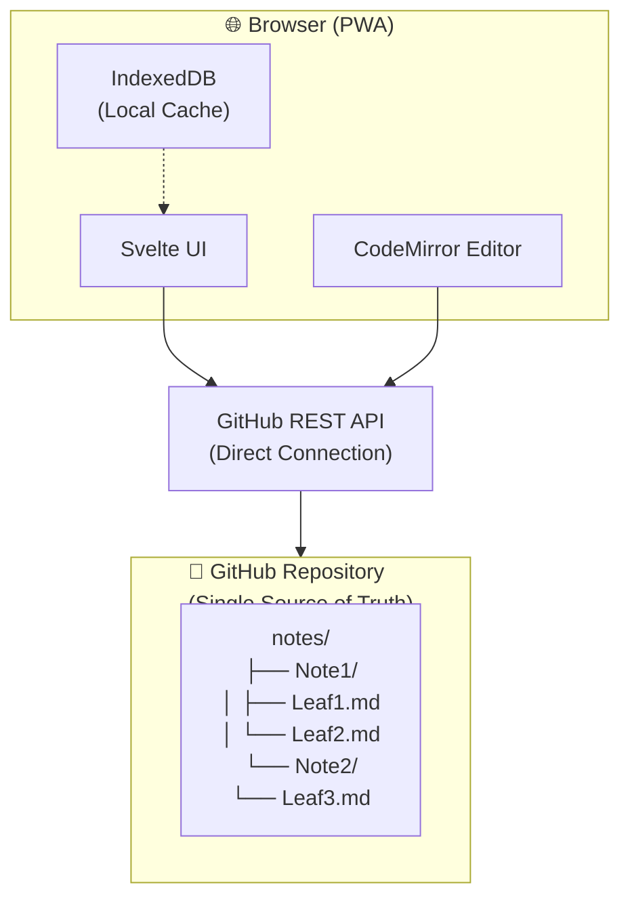
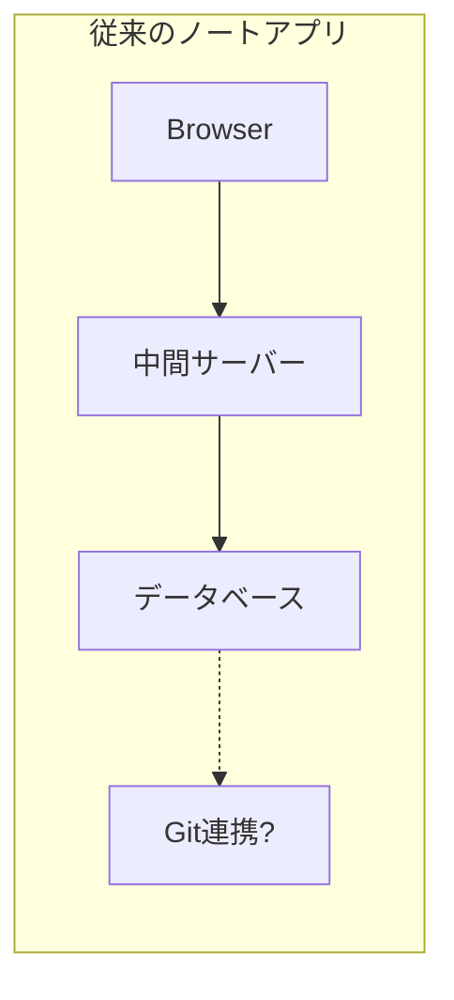
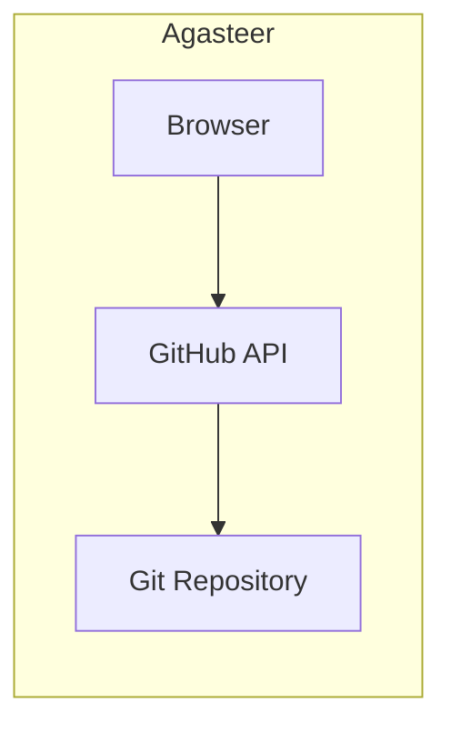

# Agasteer

  <picture>
    <source srcset="./public/assets/app-icon.webp" type="image/webp">
    
  </picture>

  <strong>The Simplest Markdown App with GitHub Sync</strong> 
  <em>GitHubと直接つながる、最もシンプルなMarkdownノートアプリ</em>

  🔊 <b>Agasteer</b> [æɡəstíːr] — アガスティーア

  
  
  
  
  

---

## 💭 設計思想 - なぜシンプルにこだわるのか

### Markdownは「資産」になる

AIエージェントが日常的にファイルを読み書きする時代が来ています。そのとき、あなたのノートがどんな形式で保存されているかが重要になります。

- **標準的なMarkdown** → AIが読める、他のツールでも開ける、10年後も使える
- **独自フォーマット** → 特定のアプリでしか開けない、サービス終了で読めなくなるリスク

Agasteerで書いたノートは、いつでもGoogleやOpenAIのサービスに渡せます。VSCodeで開けます。GitHubで検索できます。**あなたのノートは、あなたのものです。**

### 疎結合という自由

高機能なノートアプリは魅力的です。でも、プラグインやエコシステムに深く依存すると、いつの間にかそのアプリなしでは何もできなくなります。

Agasteerは意図的に「薄い」アプリです：

- **GitHubは単なる保存先** - 明日Dropboxに変えても、ノートはそのまま
- **エディタは単なる入力欄** - VSCodeで編集しても、全く問題ない
- **アプリは単なるビューア** - Agasteerがなくなっても、.mdファイルは残る

**便利さのために自由を売り渡さない。** それがAgasteerの設計思想です。

### コンフリクトとの戦い

作者は多くのノートアプリを使ってきました。そして、ほぼ全てのアプリで同じ問題に悩まされました：

- オフラインで編集して、オンラインに戻ったら **コンフリクト**
- ずっとオンラインなのに、別端末に切り替えたら **同期が遅くてコンフリクト**

特にメモアプリは1行目を頻繁に編集します。なのに、既存アプリの多くはこの問題に対して大した工夫をしていません。

Agasteerの答えはシンプルです：

- **起動時に必ずPull** - 古いローカルデータで作業を始めない
- **GitHubが唯一の真実** - 迷ったらPullすればいい

完璧ではありません。でも、「なんか知らないうちにデータが消えた」という最悪の体験を、極限まで減らすことを目指しています。

---

## 🏗️ アーキテクチャ - なぜシンプルで速いのか

Agasteerは「**The Simplest Markdown App**」を目指して設計されています。

### 🚀 高速化の工夫

| 工夫               | 説明                                | 効果                      |
| ------------------ | ----------------------------------- | ------------------------- |
| **Git Tree API**   | 複数ファイルを1リクエストで一括Push | API呼び出し回数を大幅削減 |
| **SHA最適化**      | 変更されたファイルのみ転送          | 通信量を最小化            |
| **並列取得**       | 最大10ファイル同時にPull            | 待ち時間を短縮            |
| **優先読み込み**   | URLで指定されたリーフを最優先で取得 | 体感速度を向上            |
| **スケルトンUI**   | 読み込み中もレイアウト確定          | ガタつきのない表示        |
| **テキストのまま** | Base64エンコード不要                | 処理オーバーヘッドなし    |

### 💡 シンプルさの根拠

- **中間サーバーなし**: 静的ホスティングのみで運用可能
- **データベースなし**: GitHubリポジトリがそのままデータストア
- **独自フォーマットなし**: 標準的なMarkdownファイル
- **アカウント不要**: GitHub Personal Access Tokenのみ

---

## 📊 競合サービスとの比較

| サービス     | 価格      | オフライン | GitHub連携    | データ形式   | サーバー依存 | インストール |
| ------------ | --------- | ---------- | ------------- | ------------ | ------------ | ------------ |
| **Agasteer** | 無料      | ✅         | ✅ 直接       | Markdown     | なし         | 不要(PWA)    |
| Notion       | 無料/有料 | ⚠️ 一部    | ❌            | 独自         | あり         | 不要/アプリ  |
| Obsidian     | 無料/有料 | ✅         | ⚠️ プラグイン | Markdown     | なし/あり    | 必要         |
| Logseq       | 無料      | ✅         | ⚠️ プラグイン | Markdown/Org | なし         | 必要         |
| Evernote     | 無料/有料 | ⚠️ 有料    | ❌            | 独自         | あり         | 必要         |
| OneNote      | 無料      | ✅         | ❌            | 独自         | あり         | 必要         |
| Simplenote   | 無料      | ✅         | ❌            | プレーン     | あり         | 必要         |
| Cosense      | 無料/有料 | ❌         | ❌            | 独自         | あり         | 不要         |
| Bear         | 有料      | ✅         | ❌            | 独自         | なし/あり    | 必要(Apple)  |
| Todoist      | 無料/有料 | ⚠️ 一部    | ❌            | 独自         | あり         | 不要/アプリ  |

### Agasteerの優位性

1. **コンフリクトが起きにくい** - 起動時に必ずPullする設計で、「知らない間に古いデータを上書き」を防止
2. **データが消えない** - GitHubに保存されるので、端末が壊れてもデータは安全
3. **どこでも同じ体験** - ブラウザさえあればPC・スマホ・タブレットで同じように使える
4. **乗り換え自由** - 標準Markdownなので、他のアプリでもそのまま開ける
5. **完全無料** - 機能制限なし、GitHubの無料プランで十分
6. **インストール不要** - ブラウザで開くだけ、PWAでホーム画面にも追加可能

---

## 💰 通信量と費用の目安

### Pull/Push 1回あたりの通信量

| 操作     | API呼び出し  | 通信量目安   |
| -------- | ------------ | ------------ |
| **Pull** | 1 + リーフ数 | 数KB〜数百KB |
| **Push** | 3〜5回       | 数KB〜数十KB |

※ リーフ1つあたり平均2KBと仮定

### 月間費用の目安

| 利用パターン          | Pull/Push回数 | 費用     |
| --------------------- | ------------- | -------- |
| 軽い利用（週数回）    | 〜30回/月     | **無料** |
| 通常利用（毎日）      | 〜100回/月    | **無料** |
| ヘビー利用（1日数回） | 〜300回/月    | **無料** |

> 💡 **GitHubは無料プランでも十分** - 月間通信量の上限はなく、APIレート制限（5,000回/時間）内であれば費用は発生しません。

---

## ✨ 特長

### 🚀 完全ブラウザベース

サーバー不要、ブラウザだけで完結するMarkdownノートアプリです。

- IndexedDBによる高速なローカルストレージ
- オフラインでも快適に編集可能
- 静的ホスティングで簡単に公開可能

### 🔗 GitHub直接同期

Personal Access Tokenで直接GitHubリポジトリに保存できます。

- Git Tree APIによる高速一括Push
- SHA最適化で変更されたファイルのみ転送
- 未保存変更の確認機能

### ✏️ 高機能エディタ

CodeMirror 6による快適な編集環境を提供します。

- マークダウンプレビュー機能（marked + DOMPurify）
- 編集/プレビュー間のスクロール同期
- リーフタイトルと#見出しの双方向同期
- Vimモード対応（カスタムコマンド`:w` `:q` `:wq`、ペイン切り替え`<Space>`）

### 📱 2ペイン表示

横長画面では左右2ペインで同時編集できます。

- アスペクト比自動判定（横 > 縦で2ペイン表示）
- スマホ横向きにも対応
- 左右独立したナビゲーション

### 🎨 豊富なカスタマイズ

6種類のテーマとカスタマイズ機能を搭載しています。

- **6種類のテーマ**: yomi, campus, greenboard, whiteboard, dotsD, dotsF
- **カスタムフォント**: .ttf/.otf/.woff/.woff2をアップロード可能
- **カスタム背景画像**: 左右ペイン別々に設定可能
- **国際化対応**: 日本語・英語の自動切替

---

## 🚀 クイックスタート

すぐに試せるデモサイトを用意しています：

**[https://agasteer.llll-ll.com](https://agasteer.llll-ll.com)**

ブラウザで開くだけで、すぐにノートの作成・編集が可能です。

開発環境のセットアップについては、[CONTRIBUTING.md](./CONTRIBUTING.md)をご覧ください。

---

## 📖 ドキュメント

### ユーザー向けドキュメント

Agasteerの使い方を学ぶための包括的なガイドです。

→ **[ユーザーガイド](./docs/user-guide/index.md)**

- [初期設定とクイックスタート](./docs/user-guide/getting-started.md)
- [ノートとリーフの管理](./docs/user-guide/basic-features.md)
- [応用機能（2ペイン、プレビュー、Vimモード）](./docs/user-guide/advanced-features.md)
- [GitHub連携](./docs/user-guide/github-sync.md)
- [カスタマイズ（テーマ、フォント、背景画像）](./docs/user-guide/customization.md)
- [よくある質問（FAQ）](./docs/user-guide/faq.md)

### 開発者向けドキュメント

Agasteerの技術仕様と開発ガイドです。

→ **[開発者向けドキュメント](./docs/development/index.md)**

- [アーキテクチャ](./docs/development/architecture.md)
- [データモデルと状態管理](./docs/development/data-model.md)
- [開発ガイド](./docs/development/development.md)
- [拡張計画と既知の課題](./docs/development/future-plans.md)

### 共有リソース

- [GitHub Personal Access Tokenの取得](./docs/shared/github-token.md)

---

## ⚠️ GitHub API レート制限について

AgasteerはGitHub APIを直接使用するため、**レート制限**に注意が必要です。

> ⚠️ これはAgasteer独自の制限ではなく、**GitHub APIの仕様**です。無料プランでも有料プランでも適用される制限であり、GitHub公式ドキュメントに記載されています。
>
> 参考: [GitHub REST API rate limits](https://docs.github.com/en/rest/rate-limit)

### 制限の概要

| 項目                   | 値                             |
| ---------------------- | ------------------------------ |
| 認証済みユーザーの上限 | **5,000リクエスト/時間**       |
| Pull 1回あたりの消費   | 約 **1 + リーフ数** リクエスト |
| Push 1回あたりの消費   | 約 **3〜5** リクエスト         |

### 具体例

- リーフ50個のノート → Pull 1回で約50リクエスト消費
- リーフ100個のノート → Pull 1回で約100リクエスト消費
- 1時間に50回Pullすると制限に達する可能性あり

### 注意事項

- **Pullボタンを連打しない** - 必要なときだけ押してください
- **制限に達した場合** - 1時間待つと制限がリセットされます
- **エラーが出たら** - しばらく待ってから再試行してください

> 💡 通常の使用（1日数回のPull/Push）では制限に達することはほとんどありません。

---

## 🤝 コントリビューション

Issue、Pull Requestを歓迎します！詳しくは[CONTRIBUTING.md](./CONTRIBUTING.md)をご覧ください。

---

## 📄 ライセンス

このプロジェクトはMITライセンスの下で公開されています。

---

## 🙏 謝辞

- [Svelte](https://svelte.dev/) - リアクティブフレームワーク
- [Vite](https://vitejs.dev/) - 高速ビルドツール
- [CodeMirror](https://codemirror.net/) - 高機能エディタ
- [GitHub API](https://docs.github.com/en/rest) - リポジトリ連携
- [marked](https://marked.js.org/) - Markdownパーサー
- [DOMPurify](https://github.com/cure53/DOMPurify) - HTMLサニタイザー
- [svelte-i18n](https://github.com/kaisermann/svelte-i18n) - 国際化ライブラリ

---

© kako-jun
