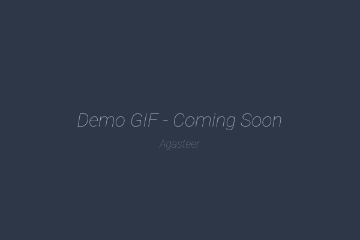

# Agasteer

  <picture>
    <source srcset="./public/assets/app-icon.webp" type="image/webp">
    
  </picture>

  <strong>The Simplest Markdown App with GitHub Sync</strong> 
  <em>A markdown note app that connects directly to GitHub</em>

  <b>Agasteer</b> [æɡəstíːr]

  <a href="https://agasteer.llll-ll.com"><strong>▶ Try it now → agasteer.llll-ll.com</strong></a>

  No installation required - Just open in browser (GitHub account needed)

<!-- TODO: Demo GIF (5-10 sec, showing 2-pane view and Push/Pull) -->

  

<!-- TODO: YouTube intro video (2-3 min, from setup to basic usage) -->

  

  
  
  
  

---

## Features

| Feature                | Description                                                   |
| ---------------------- | ------------------------------------------------------------- |
| **No Conflicts**       | Always Pull on startup - GitHub is the single source of truth |
| **Direct GitHub Sync** | No intermediate server - saves directly to your repository    |
| **Mobile & Desktop**   | Vim mode for fast editing on PC, touch-friendly on mobile     |
| **Customizable**       | Themes, ruled-line mode, custom fonts, background images      |

→ See [User Guide](./docs/user-guide/en/index.md) for details

---

## Design Philosophy - Why We Obsess Over Simplicity

### The Battle Against Conflicts

The author suffered from conflicts in popular note apps for years.
One day, finally fed up, decided to build "an app where conflicts are theoretically impossible."
With Agasteer, free yourself from the fear of data loss.

- **Always Pull on startup** - Never start working with stale local data
- **GitHub is the single source of truth** - When in doubt, just Pull

### Markdown Will Become Your "Asset"

In an age where AI reads and writes files, don't trade your freedom for convenience.
Shopping lists, AI prompts, movie watchlists - write them all in Agasteer.

- **Standard Markdown** - Edit directly on GitHub, use as input for any AI service
- **Just .md files** - Open in VSCode, view diffs and history, usable 10 years from now

### Lightweight, Fast, Transparent

No intermediate server. No ads. Browser communicates directly with GitHub API.
Start your simple, transparent note-taking experience with Agasteer.

- **Open Source** - [View the code](https://github.com/kako-jun/agasteer)
- **Self-hostable** - Host on your own server ([CONTRIBUTING.md](./CONTRIBUTING.md))

---

## Why Agasteer?

- **Direct GitHub Sync** - No intermediate server, saves directly to your repository
- **Standard Markdown** - No proprietary format, opens in VSCode or any AI tool
- **No Installation** - Just open in browser, add to home screen as PWA
- **Completely Free** - No feature restrictions, GitHub free plan is enough
- **Import Support** - Migration from other services being added

> **Why no comparison table?**: There are no competitors with the concept of "browser-based note app that saves directly to GitHub."
> Our direction differs from business models that profit by holding user data.

### Unique Features

- **Vim Mode!** - Built for keyboard-only fastest note-taking. Navigate with `hjkl`!
- **Ruled-Line Mode!** - Looks just like a real notebook. Why doesn't everyone have this!?
- **Cute Japanese Themes!** - Custom fonts and background images. The author uses a retro RPG blue-window style!

---

## Getting Started

The only hassle is getting your token the first time.
If you've been thinking "I should make a GitHub account someday," this is your chance.

In the AI era, having a GitHub account opens up many possibilities.

→ [Quick Start](./docs/user-guide/en/quick-start.md)

---

## Documentation

### For Users

→ **[User Guide](./docs/user-guide/en/index.md)** - Setup, basic usage, advanced features, customization

### For Developers

→ **[Developer Documentation](./docs/development/index.md)** - Architecture, data model, development guide

---

## Contributing

Issues and Pull Requests are welcome! See [CONTRIBUTING.md](./CONTRIBUTING.md) for details.

---

## License

This project is released under the MIT License.

---

© kako-jun
