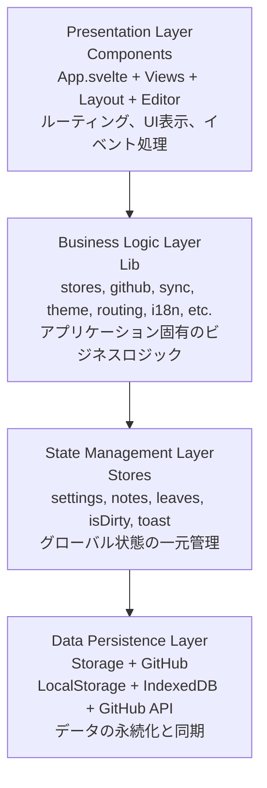

# アーキテクチャドキュメント

Agasteerのアーキテクチャ、技術スタック、プロジェクト構造について説明します。

## アーキテクチャ概要

Agasteerは、**コンポーネントベースアーキテクチャ**を採用した軽量Markdownノートアプリケーションです。

### 設計哲学

- **シンプリシティ**: 必要最小限の依存関係とコード量
- **ブラウザファースト**: サーバーレス、完全クライアントサイド
- **直接統合**: GitHub APIを直接呼び出し、中間サービス不要
- **即時性**: IndexedDB/LocalStorageによる自動保存、設定変更の即座反映
- **モジュール性**: コンポーネント分割とユーティリティ関数の再利用による保守性の向上
- **DRY原則**: 重複コードの徹底的な削減
- **遅延ロード**: 必要なデータのみを取得（アーカイブの遅延Pull等）

### アーキテクチャパターン

Agasteerは4層のレイヤー構造で設計されています。



**統計情報:**

- 総行数: 約8,100行（コメント・空行含む）
- 総ファイル数: 56個（.svelte + .ts）
- コンポーネント数: 38個（23個の一般 + 14個のアイコン + IconButton）
- libモジュール数: 14個

詳細なファイル構造は[プロジェクト構造](#プロジェクト構造)セクションを参照してください。

---

## 技術スタック

### フレームワーク & ライブラリ

| 技術                | バージョン | 役割                                |
| ------------------- | ---------- | ----------------------------------- |
| **Svelte**          | 4.2.19     | リアクティブUIフレームワーク        |
| **TypeScript**      | 5.7.2      | 型安全性の提供                      |
| **Vite**            | 5.4.10     | ビルドツール & 開発サーバー         |
| **vite-plugin-pwa** | 1.1.0      | PWA（Service Worker）自動生成       |
| **CodeMirror**      | 6.0.1      | 高機能エディタ                      |
| **marked**          | 17+        | マークダウン→HTML変換（プレビュー） |
| **DOMPurify**       | 3+         | XSSサニタイゼーション               |
| **svelte-i18n**     | 4+         | 国際化（i18n）対応                  |

### CodeMirrorエコシステム

```typescript
import { EditorState } from '@codemirror/state'
import { EditorView, keymap } from '@codemirror/view'
import { defaultKeymap, history, historyKeymap } from '@codemirror/commands'
import { markdown } from '@codemirror/lang-markdown'
import { oneDark } from '@codemirror/theme-one-dark'
import { basicSetup } from 'codemirror'
```

- **state**: エディタの状態管理
- **view**: レンダリングとUI
- **commands**: 基本的な編集コマンド（Undo/Redo等）
- **lang-markdown**: Markdown構文ハイライト
- **theme-one-dark**: ダークテーマ
- **basicSetup**: 行番号、フォールド等の基本機能

### 開発ツール

- **Prettier** (3.3.3): コード整形
- **prettier-plugin-svelte**: Svelteファイル対応
- **svelte-check** (3.8.6): 型チェック
- **Husky** (9.1.6): Gitフック管理

---

## GitHub構造

Agasteerは、GitHubリポジトリを永続化ストレージとして使用します。データは`.agasteer/`ディレクトリ配下に保存されます。

### フォルダ構造

```
.agasteer/
├── notes/                    # 通常のノート・リーフ（Homeワールド）
│   ├── metadata.json         # ノートのメタデータ（order, badge等）
│   ├── Note1/
│   │   ├── SubNote/          # サブノート（2階層まで）
│   │   │   └── leaf.md
│   │   └── leaf.md
│   └── Note2/
│       └── leaf.md
└── archive/                  # アーカイブされたノート・リーフ
    ├── metadata.json         # アーカイブのメタデータ
    ├── ArchivedNote/
    │   ├── SubNote/          # 階層構造は維持
    │   └── leaf.md
    └── standalone.md         # リーフ単体のアーカイブ
```

### ワールド（World）概念

Agasteerは**Home**と**Archive**の2つのワールドを持ちます。

| ワールド | パス                 | 説明                                           |
| -------- | -------------------- | ---------------------------------------------- |
| Home     | `.agasteer/notes/`   | 通常のノート・リーフ。Pull時に常にロード       |
| Archive  | `.agasteer/archive/` | アーカイブ済みデータ。遅延ロード（必要時のみ） |

**遅延ロード**: Archiveワールドは、ユーザーがArchiveに切り替えた時点で初めてPullされます。これにより通常のPull操作を高速に保ちます。

---

## プロジェクト構造

```
agasteer/
├── .husky/
│   └── pre-commit                       # npm run lintを実行
├── public/
│   └── assets/
│       ├── app-icon.png                 # PWA/ファビコン用アイコン（互換用PNG）
│       └── app-icon.webp                # PWA/ファビコン用アイコン（WebP）
│       ├── agasteer-icon.png            # 設定画面アイコン（About、互換用PNG）
│       └── agasteer-icon.webp           # 設定画面アイコン（About、WebP）
├── src/
│   ├── components/
│   │   ├── buttons/
│   │   │   ├── PushButton.svelte        # Pushボタン共通コンポーネント
│   │   │   └── PullButton.svelte        # Pullボタン共通コンポーネント
│   │   ├── cards/
│   │   │   └── NoteCard.svelte          # ノートカード共通コンポーネント
│   │   ├── editor/
│   │   │   └── MarkdownEditor.svelte    # CodeMirrorエディタラッパー
│   │   ├── layout/
│   │   │   ├── Breadcrumbs.svelte       # パンくずリスト
│   │   │   ├── Footer.svelte            # フッター
│   │   │   ├── Header.svelte            # ヘッダー
│   │   │   ├── Loading.svelte           # ローディング表示
│   │   │   ├── Modal.svelte             # モーダルダイアログ
│   │   │   ├── Toast.svelte             # トースト通知
│   │   │   └── footer/
│   │   │       ├── EditorFooter.svelte  # エディタ画面フッター
│   │   │       ├── HomeFooter.svelte    # ホーム画面フッター
│   │   │       ├── NoteFooter.svelte    # ノート画面フッター
│   │   │       └── PreviewFooter.svelte # プレビュー画面フッター
│   │   ├── settings/
│   │   │   ├── QRCodeSection.svelte         # QRコード表示
│   │   │   ├── HelpLinks.svelte             # ヘルプリンク
│   │   │   ├── GitHubSettings.svelte        # GitHub設定
│   │   │   ├── LanguageSelector.svelte      # 言語選択
│   │   │   ├── ThemeSelector.svelte         # テーマ選択
│   │   │   ├── ToolNameInput.svelte         # ツール名入力
│   │   │   ├── FontCustomizer.svelte        # フォントカスタマイズ
│   │   │   ├── BackgroundCustomizer.svelte  # 背景画像カスタマイズ
│   │   │   ├── VimModeToggle.svelte         # Vimモード切替
│   │   │   ├── AboutSection.svelte          # アプリ情報
│   │   │   └── VersionDisplay.svelte        # バージョン表示
│   │   └── views/
│   │       ├── EditorView.svelte        # エディタ画面
│   │       ├── HomeView.svelte          # ホーム画面
│   │       ├── NoteView.svelte          # ノート画面
│   │       ├── PreviewView.svelte       # プレビュー画面
│   │       └── SettingsView.svelte      # 設定画面
│   ├── lib/
│   │   ├── i18n/
│   │   │   ├── index.ts                 # 国際化初期化
│   │   │   └── locales/
│   │   │       ├── en.json              # 英語翻訳
│   │   │       └── ja.json              # 日本語翻訳
│   │   ├── background.ts                # カスタム背景画像管理
│   │   ├── breadcrumbs.ts               # パンくずリスト生成
│   │   ├── drag-drop.ts                 # ドラッグ&ドロップヘルパー
│   │   ├── font.ts                      # カスタムフォント管理
│   │   ├── github.ts                    # GitHub API統合
│   │   ├── routing.ts                   # URLルーティング
│   │   ├── storage.ts                   # IndexedDB/LocalStorage操作
│   │   ├── stores.ts                    # Svelte Store状態管理
│   │   ├── sync.ts                      # Push/Pull処理
│   │   ├── theme.ts                     # テーマ管理
│   │   ├── types.ts                     # TypeScript型定義
│   │   └── ui.ts                        # トースト状態管理
│   ├── app.css                          # グローバルスタイル + テーマ定義
│   ├── app.d.ts                         # TypeScript型宣言
│   ├── App.svelte                       # ルートコンポーネント (約1,400行)
│   └── main.ts                          # エントリーポイント
├── docs/                                # 詳細ドキュメント
│   ├── architecture.md                  # このファイル
│   ├── content-sync.md                  # コンテンツ同期機能
│   ├── data-model.md                    # データモデルと状態管理
│   ├── data-protection.md               # データ保護機能
│   ├── development.md                   # 開発ガイド
│   ├── features.md                      # 基本機能の実装
│   ├── future-plans.md                  # 拡張計画と既知の課題
│   ├── github-integration.md            # GitHub API統合
│   ├── preview-features.md              # プレビュー機能
│   ├── refactoring.md                   # 実装されたリファクタリング
│   ├── storage.md                       # データ永続化とストレージ
│   └── ui-features.md                   # UI/UX機能
├── dist/                                # ビルド出力（.gitignore）
├── .gitignore
├── .prettierrc                          # Prettier設定
├── .prettierignore
├── CLAUDE.md                            # 開発者向けドキュメント（目次）
├── index.html                           # HTMLエントリーポイント
├── package.json                         # プロジェクトメタデータ
├── README.md                            # ユーザー向けドキュメント
├── svelte.config.js                     # Svelte設定
├── tsconfig.json                        # TypeScript設定
├── tsconfig.node.json                   # Node用TypeScript設定
└── vite.config.ts                       # Vite設定
```

### 重要ファイルの役割

#### `src/App.svelte` (約1,400行)

アプリケーションのルートコンポーネント。ビュー切り替えとイベントハンドリングを担当。

**主な責務:**

- 2ペイン表示の管理（アスペクト比判定、左右独立ナビゲーション）
- ビューのルーティング（home/note/edit/preview/settings）
- CRUD操作（ノート・リーフ作成/削除/更新）
- ドラッグ&ドロップ処理（ノート・リーフの並び替え）
- GitHub同期の呼び出し
- モーダル管理
- URLルーティング
- スクロール同期

#### コンポーネント層

**レイアウトコンポーネント:**

- `Header.svelte`: アプリタイトルと設定アイコン
- `Breadcrumbs.svelte`: パンくずナビゲーション（インライン編集機能付き）
- `Modal.svelte`: 確認ダイアログとアラート
- `Toast.svelte`: トースト通知（Push/Pull開始時）
- `Loading.svelte`: ローディング表示（3つのドットアニメーション）
- `Footer.svelte`: フッターレイアウト
- `footer/HomeFooter.svelte`: ホーム画面用フッター
- `footer/NoteFooter.svelte`: ノート画面用フッター
- `footer/EditorFooter.svelte`: エディタ画面用フッター（プレビュートグル、ダウンロード、削除）
- `footer/PreviewFooter.svelte`: プレビュー画面用フッター

**ビューコンポーネント:**

- `HomeView.svelte`: ルートノート一覧表示
- `NoteView.svelte`: ノート内のサブノートとリーフ一覧
- `EditorView.svelte`: リーフ編集画面（CodeMirrorエディタ）
- `PreviewView.svelte`: マークダウンプレビュー画面（marked + DOMPurify）
- `SettingsView.svelte`: 設定画面（コンポーネントの羅列のみ、約100行）

**設定コンポーネント:**

- `QRCodeSection.svelte`: QRコード表示（デモサイトへのリンク）
- `HelpLinks.svelte`: ヘルプリンク（README、動画）
- `GitHubSettings.svelte`: GitHub連携設定（Token、リポジトリ名、ユーザー名、メール）
- `LanguageSelector.svelte`: 言語選択ドロップダウン（日本語・英語）
- `ThemeSelector.svelte`: テーマ選択（yomi, campus, greenboard, whiteboard, dotsD, dotsF）
- `ToolNameInput.svelte`: ツール名入力フィールド
- `FontCustomizer.svelte`: カスタムフォント機能（.ttf/.otf/.woff/.woff2）
- `BackgroundCustomizer.svelte`: カスタム背景画像機能（.jpg/.png/.webp/.gif、透明度0.1固定）
- `VimModeToggle.svelte`: Vimモード切替チェックボックス
- `AboutSection.svelte`: アプリ情報、作者、スポンサーリンク
- `VersionDisplay.svelte`: バージョン表示（ビルド日付を自動表示）

**共通コンポーネント:**

- `MarkdownEditor.svelte`: CodeMirrorラッパー
- `NoteCard.svelte`: ノートカード共通コンポーネント（HomeViewとNoteViewで使用）
- `PushButton.svelte`: Pushボタン共通コンポーネント（isDirty状態バッジ付き）
- `PullButton.svelte`: Pullボタン共通コンポーネント（isStale状態バッジ付き）

#### ビジネスロジック層（lib/）

**状態管理:**

- `stores.ts`: Svelteストアによる状態管理（notes, leaves, settings, isDirty, toast等）

**GitHub同期:**

- `github.ts`: GitHub API統合（ファイル保存、SHA取得、Git Tree API）
- `sync.ts`: Push/Pull処理の分離

**データ永続化:**

- `storage.ts`: IndexedDB/LocalStorageへの読み書き（汎用ヘルパー関数）

**UI/UX:**

- `theme.ts`: テーマ適用ロジック
- `routing.ts`: URLルーティング（パスベース、プレビュー対応）
- `ui.ts`: トースト状態管理
- `font.ts`: カスタムフォント管理（IndexedDB保存、動的@font-face登録）
- `background.ts`: カスタム背景画像管理（IndexedDB保存、CSS ::before適用）
- `breadcrumbs.ts`: パンくずリスト生成（H1タイトル抽出、タイトル更新）
- `drag-drop.ts`: ドラッグ&ドロップヘルパー（汎用型対応）

**国際化:**

- `i18n/index.ts`: 国際化初期化（svelte-i18n）
- `i18n/locales/en.json`: 英語翻訳
- `i18n/locales/ja.json`: 日本語翻訳

**型定義:**

- `types.ts`: TypeScript型定義（Settings, Note, Leaf, View, Pane, WorldType等）

**WorldType:**

```typescript
// ワールド（Home/Archive）の識別子
type WorldType = 'home' | 'archive'
```

#### `src/main.ts`

Svelteアプリケーションのエントリーポイント。

```typescript
import './app.css'
import './lib/i18n' // i18n初期化
import App from './App.svelte'

const app = new App({
  target: document.getElementById('app')!,
})

export default app
```

#### `src/app.css`

CSS変数を使用したテーマシステムの実装。

```css
:root {
  /* lightテーマのデフォルト値 */
}
:root[data-theme='dark'] {
  /* darkテーマのオーバーライド */
}
:root[data-theme='blackboard'] {
  /* ... */
}
:root[data-theme='kawaii'] {
  /* ... */
}
:root[data-theme='custom'] {
  /* ユーザー定義の変数 */
}
```

#### `vite.config.ts`

パフォーマンス最適化とPWA対応を含むビルド設定。

```typescript
import { VitePWA } from 'vite-plugin-pwa'

export default defineConfig({
  plugins: [
    svelte(),
    VitePWA({
      registerType: 'autoUpdate',
      workbox: {
        globPatterns: ['**/*.{js,css,html,ico,png,svg,woff,woff2}'],
        runtimeCaching: [
          {
            urlPattern: /^https:\/\/api\.github\.com\/.*/i,
            handler: 'NetworkFirst',
            options: {
              cacheName: 'github-api-cache',
              expiration: { maxAgeSeconds: 300 },
            },
          },
        ],
      },
      manifest: {
        name: 'Agasteer',
        short_name: 'Agasteer',
        description: 'A simple markdown note-taking app with GitHub sync',
        theme_color: '#1a1a1a',
        background_color: '#1a1a1a',
        display: 'standalone',
        start_url: '/',
      },
    }),
  ],
  base: '/',
  build: {
    rollupOptions: {
      output: {
        manualChunks: {
          codemirror: ['codemirror', '@codemirror/view', '@codemirror/state', ...],
          'markdown-tools': ['marked', 'dompurify'],
          i18n: ['svelte-i18n'],
        },
      },
    },
  },
})
```

---

## コードアーキテクチャ

### レイヤー構造

アプリケーションは以下の3層構造に分離されています：

#### 1. プレゼンテーション層（Components）

**責務**: UIの表示とユーザーインタラクション

**ビューコンポーネント:**

```svelte
<!-- App.svelte -->
{#if leftView === 'home'}
  <HomeView pane="left" ... />
{:else if leftView === 'note'}
  <NoteView pane="left" ... />
{:else if leftView === 'edit'}
  <EditorView pane="left" ... />
{:else if leftView === 'preview'}
  <PreviewView pane="left" ... />
{:else if leftView === 'settings'}
  <SettingsView pane="left" ... />
{/if}

<!-- 2ペイン表示時は右ペインも同様 -->
{#if showTwoPane}
  {#if rightView === 'home'}
    <HomeView pane="right" ... />
    <!-- ... -->
  {/if}
{/if}
```

各ビューは独立したコンポーネントとして実装され、propsを通じてデータとイベントハンドラを受け取ります。

#### 2. ビジネスロジック層（App.svelte + lib/）

**App.svelteの主要関数:**

| カテゴリ           | 主要関数                                                                                                     |
| ------------------ | ------------------------------------------------------------------------------------------------------------ |
| **ノート管理**     | `createNote()`, `selectNote()`, `deleteNote()`, `updateNoteTitle()`                                          |
| **リーフ管理**     | `createLeaf()`, `selectLeaf()`, `deleteLeaf()`, `updateLeafTitle()`, `updateLeafContent()`, `downloadLeaf()` |
| **並び替え・移動** | `handleDragStart()`, `handleDragEnd()`, `handleDragOver()`, `handleDropNote()`, `handleDropLeaf()`           |
| **ナビゲーション** | `getBreadcrumbs()`, `goHome()`, `selectNote()`, `selectLeaf()`                                               |
| **プレビュー**     | `togglePreview()`                                                                                            |
| **スクロール同期** | `handlePaneScroll()`                                                                                         |
| **GitHub同期**     | `handlePush()`, `handlePull()`                                                                               |
| **モーダル**       | `showConfirm()`, `showAlert()`, `closeModal()`                                                               |
| **設定**           | `openSettings()`, `closeSettings()`, `saveSettings()`, `testGitHubConnection()`                              |
| **ヘルパー**       | `getItemCount()`, `getNoteLeaves()`                                                                          |

**lib/モジュール:**

- `github.ts`: GitHub API統合（`saveToGitHub()`, `pushAllWithTreeAPI()`, `pullFromGitHub()`等）
- `sync.ts`: Push/Pull処理（`pushToGitHub()`, `pullFromGitHub()`）
- `theme.ts`: テーマ適用ロジック（`applyTheme()`）
- `routing.ts`: URLルーティング（`updateURL()`, `parseURL()`）
- `breadcrumbs.ts`: パンくずリスト生成（`getBreadcrumbs()`, `extractH1Title()`, `updateH1Title()`）
- `drag-drop.ts`: ドラッグ&ドロップヘルパー（`handleDragStart<T>()`, `reorderItems<T>()`）

#### 3. 状態管理層（lib/stores.ts）

**責務**: アプリケーション全体の状態管理

```typescript
// Writable stores（Home用）
export const settings = writable<Settings>(defaultSettings)
export const notes = writable<Note[]>([])
export const leaves = writable<Leaf[]>([])
export const isDirty = writable<boolean>(false)
export const toast = writable<Toast | null>(null)

// Archive用ストア
export const archiveNotes = writable<Note[]>([])
export const archiveLeaves = writable<Leaf[]>([])
export const isArchiveLoaded = writable<boolean>(false)

// 現在のワールド
export const currentWorld = writable<WorldType>('home')

// Derived stores（最小限に削減）
export const allNotes = derived(notes, ($notes) => $notes.sort((a, b) => a.order - b.order))
```

**注**: Version 5.0のリファクタリングにより、左右ペインの状態は**ローカル変数**で管理されるようになりました。`currentView`, `currentNote`, `currentLeaf`等のストアは削除され、完全な左右対称設計を実現しています。

#### 4. データ永続化層（lib/storage.ts）

**責務**: IndexedDB/LocalStorageへの読み書き

```typescript
// 汎用ヘルパー関数
export async function putItem<T>(storeName: string, key: string, value: T): Promise<void>
export async function getItem<T>(storeName: string, key: string): Promise<T | null>
export async function deleteItem(storeName: string, key: string): Promise<void>

// LocalStorage（設定のみ）
export function saveSettings(settings: Settings): void
export function loadSettings(): Settings

// IndexedDB（ノート・リーフ・フォント・背景画像）
export async function saveNotesToDB(notes: Note[]): Promise<void>
export async function loadNotesFromDB(): Promise<Note[]>
export async function saveLeavesToDB(leaves: Leaf[]): Promise<void>
export async function loadLeavesFromDB(): Promise<Leaf[]>
```

---

## デプロイ

### Cloudflare Pages

このプロジェクトはCloudflare Pagesでホスティングされています。

- **デモサイト**: [https://agasteer.llll-ll.com](https://agasteer.llll-ll.com)
- **デプロイ**: GitHubリポジトリ連携による自動デプロイ
- **ビルドコマンド**: `npm run build`
- **ビルド出力**: `dist/`

### ビルドプロセス

```bash
# 開発サーバー起動
npm run dev

# 本番ビルド
npm run build

# ビルド結果のプレビュー
npm run preview
```

### パフォーマンス最適化（Version 6.1）

#### 遅延ロード戦略

大きなライブラリを動的インポートで必要な時だけロードすることで、初回表示を大幅に高速化しています。

**CodeMirrorの遅延ロード:**

```typescript
// MarkdownEditor.svelte
async function loadCodeMirror() {
  const [
    { EditorState: ES },
    { EditorView: EV, keymap: km },
    { defaultKeymap: dk, history: h, historyKeymap: hk },
    { markdown: md },
    { basicSetup: bs },
  ] = await Promise.all([
    import('@codemirror/state'),
    import('@codemirror/view'),
    import('@codemirror/commands'),
    import('@codemirror/lang-markdown'),
    import('codemirror'),
  ])
  // ...
}

onMount(async () => {
  await loadCodeMirror()
  initializeEditor()
})
```

**marked/DOMPurifyの遅延ロード:**

```typescript
// PreviewView.svelte
async function loadMarkdownTools() {
  const [{ marked: m }, DOMPurifyModule] = await Promise.all([
    import('marked'),
    import('dompurify'),
  ])
  marked = m
  DOMPurify = DOMPurifyModule.default
}
```

#### マニュアルチャンク分割

Viteの`manualChunks`設定により、ベンダーライブラリを効率的に分割：

- **codemirror チャンク**: 609.98 KB（gzip: 209.03 KB）
- **markdown-tools チャンク**: 64.07 KB（gzip: 21.44 KB）
- **i18n チャンク**: 60.47 KB（gzip: 19.42 KB）
- **メインバンドル**: 115.82 KB（gzip: 33.94 KB）

各チャンクは独立してブラウザキャッシュされるため、ライブラリ更新時も最小限の再ダウンロードで済みます。

#### PWA（Progressive Web App）対応

Service Workerによる静的アセットとAPIレスポンスのキャッシュ：

- **プリキャッシュ**: HTML、CSS、JS、アイコン、フォントファイル
- **ランタイムキャッシュ**: GitHub API（5分間、NetworkFirstストラテジー）
- **オフライン基本動作**: キャッシュされたアセットで起動可能

#### 最適化効果

| 画面           | 最適化前（gzip） | 最適化後（gzip）          | 削減率 |
| -------------- | ---------------- | ------------------------- | ------ |
| ホーム画面     | 278.78 KB        | 33.94 KB                  | 87.8%  |
| エディタ画面   | 278.78 KB        | 242.97 KB                 | 12.9%  |
| プレビュー画面 | 278.78 KB        | 55.38 KB                  | 80.1%  |
| 2回目以降      | -                | ほぼ瞬時（PWAキャッシュ） | -      |

**体感速度の改善:**

- 初回表示: 1-2秒程度の大幅改善
- エディタ初回起動: 約0.5秒（CodeMirrorローディング）
- プレビュー初回起動: 約0.2秒（marked/DOMPurifyローディング）
- 2回目以降: Service Workerによりほぼ瞬時に起動

---

## まとめ

Agasteerは、Svelteのリアクティブシステムとコンポーネントベースアーキテクチャを活用した、シンプルで強力なMarkdownノートアプリケーションです。

**主要な特徴:**

- 約8,400行のコード（59ファイル、45コンポーネント、14モジュール）
- 完全なブラウザベース実装
- GitHub API直接統合
- IndexedDB/LocalStorageによる永続化
- 2ペイン表示対応
- **Home/Archiveワールド分離**（遅延ロードによる高速Pull）
- カスタムフォント・背景画像機能
- 国際化対応（日本語・英語）
- 徹底的なコード重複削減（DRY原則）
- 共通化されたIconButtonとアイコンコンポーネント

**2025-11-24 - 大規模リファクタリング:**

- 約372行のコード削減（状態管理・ナビゲーション統一）
- コンポーネント分割（15個→38個）
- モジュール化（7個→14個）
- 汎用ユーティリティ関数の導入
- 完全な左右対称設計
- ボタン共通化（IconButton + 14アイコン）

**2025-11-24 - パフォーマンス最適化:**

- CodeMirror/marked/DOMPurifyの遅延ロード
- Viteマニュアルチャンク分割
- PWA（Service Worker）対応
- 初回表示速度87.8%削減（ホーム画面）
- 2回目以降ほぼ瞬時に起動

詳細な実装については、各ドキュメント（data-model.md, features.md, ui-features.md, development.md等）を参照してください。
