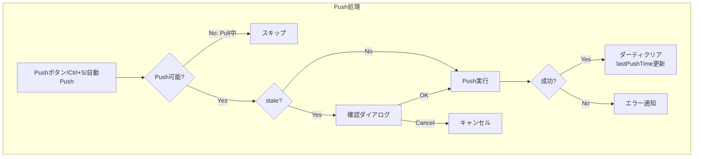
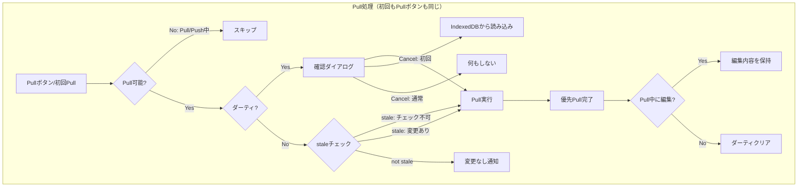
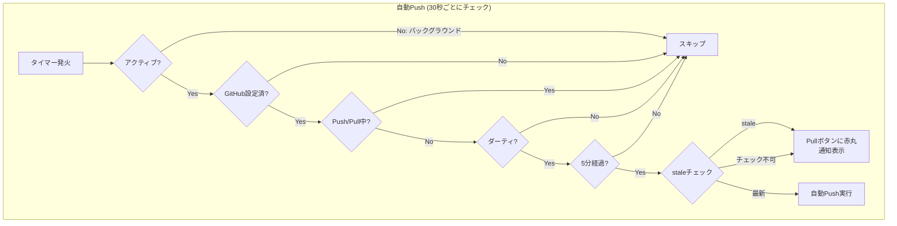

# データ保護機能

Agasteerのデータ保護関連機能の実装詳細について説明します。

## 全体フローチャート

### Push処理フロー



### Pull処理フロー

初回PullとPullボタンは完全に同じロジックで動作します。起動時は「自動的にPullボタンを押す」のと同じです。



**staleチェックの判定:**

- 空リポジトリ（metadata.jsonなし）→ チェック不可（-1）→ stale扱い → Pull実行
- 設定無効・認証エラー・ネットワークエラー → チェック不可（-1）→ stale扱い → Pull実行（適切なエラー表示）
- リモートpushCount > ローカル → stale → Pull実行
- リモートpushCount <= ローカル → not stale → 「変更なし」通知

### 自動Push処理フロー



---

## Push回数カウント機能

### 概要

アプリの使用状況を可視化するため、GitHub Push回数をカウントして統計情報として表示します。ユーザーがアプリを使い続けてきた長さを示し、楽しみを提供する機能です。

### データ構造

Push回数は `metadata.json` の `pushCount` フィールドに保存されます。

```typescript
export interface Metadata {
  version: number
  notes: Record<string, { id: string; order: number }>
  leaves: Record<string, { id: string; updatedAt: number; order: number }>
  pushCount: number // Push回数
}
```

### Push時の自動インクリメント

`pushAllWithTreeAPI` 関数内で、Push実行前に既存の `pushCount` を取得し、インクリメントします。

```typescript
// 既存のmetadata.jsonからpushCountを取得
let currentPushCount = 0
try {
  const metadataRes = await fetch(
    `https://api.github.com/repos/${settings.repoName}/contents/notes/metadata.json`,
    { headers }
  )
  if (metadataRes.ok) {
    const metadataData = await metadataRes.json()
    if (metadataData.content) {
      const base64 = metadataData.content.replace(/\n/g, '')
      const decoded = atob(base64)
      const existingMetadata: Metadata = JSON.parse(decoded)
      currentPushCount = existingMetadata.pushCount || 0
    }
  }
} catch (e) {
  // エラーは無視（初回Pushの場合）
}

// metadata.jsonを生成
const metadata: Metadata = {
  version: 1,
  notes: {},
  leaves: {},
  pushCount: currentPushCount + 1, // インクリメント
}
```

### Pull時のデータ取得

`pullFromGitHub` 関数内で、metadata.jsonから `pushCount` を取得し、Svelteストアに保存します。

```typescript
// notes/metadata.jsonを取得
let metadata: Metadata = { version: 1, notes: {}, leaves: {}, pushCount: 0 }
try {
  const metadataRes = await fetch(
    `https://api.github.com/repos/${settings.repoName}/contents/notes/metadata.json`,
    { headers }
  )
  if (metadataRes.ok) {
    const metadataData = await metadataRes.json()
    if (metadataData.content) {
      const base64 = metadataData.content.replace(/\n/g, '')
      const jsonText = decodeURIComponent(escape(atob(base64)))
      const parsed = JSON.parse(jsonText)
      // 古いmetadata.jsonにはpushCountがない可能性があるので、デフォルト値を設定
      metadata = {
        version: parsed.version || 1,
        notes: parsed.notes || {},
        leaves: parsed.leaves || {},
        pushCount: parsed.pushCount || 0,
      }
    }
  }
} catch (e) {
  console.warn('notes/metadata.json not found or invalid, using defaults')
}

return {
  success: true,
  message: '✅ Pull OK',
  notes: sortedNotes,
  leaves: sortedLeaves,
  metadata, // metadataを返す
}
```

### ストア管理

`stores.ts` に metadata ストアを追加。

```typescript
export const metadata = writable<Metadata>({
  version: 1,
  notes: {},
  leaves: {},
  pushCount: 0,
})
```

App.svelte でPull時にmetadataをストアに保存：

```typescript
// GitHubから取得したデータでIndexedDBを再作成
updateNotes(result.notes)
updateLeaves(result.leaves)
metadata.set(result.metadata) // metadataを保存
```

### UI表示

HomeView.svelte でホーム画面の右下に統計情報を表示。

```svelte
<div class="statistics">
  <div class="stat-item">
    <div class="stat-label">Push回数</div>
    <div class="stat-value">{$metadata.pushCount}</div>
  </div>
</div>
```

```css
.statistics {
  position: absolute;
  bottom: 1rem;
  right: 1rem;
  z-index: 0; /* ノート・リーフカードの背面 */
  opacity: 0.5; /* 半透明で控えめに */
  pointer-events: none; /* クリック不可 */
}

.stat-value {
  font-size: 2rem;
  font-weight: bold;
  color: var(--accent-color);
}
```

### 後方互換性

古いバージョンで作成された `metadata.json` には `pushCount` フィールドがない可能性があります。そのため、Pull時にフォールバック処理を実装：

```typescript
pushCount: parsed.pushCount || 0
```

フィールドが存在しない場合は `0` として扱われます。

### 動作フロー

1. **初回Pull**: metadata.jsonから `pushCount: 0` を取得
2. **初回Push**: `pushCount` を1にインクリメントしてGitHubに保存
3. **2回目Pull**: `pushCount: 1` を取得してホーム画面に表示
4. **2回目Push**: `pushCount` を2にインクリメント
5. **以降同様に継続**

### 表示位置とデザイン

- **表示位置**: ホーム画面の右下
- **z-index**: 0（ノート・リーフカードの背面）
- **opacity**: 0.5（半透明で控えめ）
- **ラベル**: 小さなグレーのテキスト
- **数値**: 大きく太字でアクセントカラー

これにより、ユーザーの視線を邪魔せず、かつアプリを使い続けてきた実績を可視化できます。

---

## 未保存変更の確認機能

### 概要

GitHubにPushされていない変更がある状態で、データを失う可能性のある操作を行う際に確認ダイアログを表示します。

### ダーティフラグ管理

#### isDirtyストア

GitHubにPushされていない変更があるかどうかを追跡する`isDirty`ストア（`stores.ts`）。

```typescript
// isDirtyをLocalStorageに永続化するカスタムストア
// PWA強制終了後も未保存状態を検出可能にする
const IS_DIRTY_KEY = 'agasteer_isDirty'

function createIsDirtyStore() {
  // LocalStorageから初期値を読み込み
  const stored = localStorage.getItem(IS_DIRTY_KEY)
  const initial = stored === 'true'

  const { subscribe, set: originalSet, update } = writable<boolean>(initial)

  return {
    subscribe,
    set: (value: boolean) => {
      originalSet(value)
      // LocalStorageに永続化
      if (value) {
        localStorage.setItem(IS_DIRTY_KEY, 'true')
      } else {
        localStorage.removeItem(IS_DIRTY_KEY)
      }
    },
    update,
  }
}

export const isDirty = createIsDirtyStore()
```

**LocalStorage永続化の目的:**

PWAがOSによってバックグラウンドで強制終了された場合、`beforeunload`イベントが発火しません。この場合、メモリ上の`isDirty`フラグは失われますが、LocalStorageに永続化することで、再起動後も未保存状態を検出できます。

#### ダーティフラグが立つタイミング

1. **エディタで編集時** (`MarkdownEditor.svelte`)

   ```typescript
   EditorView.updateListener.of((update) => {
     if (update.docChanged) {
       const newContent = update.state.doc.toString()
       onChange(newContent)
       // エディタで変更があったらダーティフラグを立てる
       isDirty.set(true)
     }
   })
   ```

2. **ノート操作時** (`stores.ts`)

   ```typescript
   export function updateNotes(newNotes: Note[]): void {
     notes.set(newNotes)
     saveNotes(newNotes).catch((err) => console.error('Failed to persist notes:', err))
     // ノートの変更があったらダーティフラグを立てる
     isDirty.set(true)
   }
   ```

3. **リーフ操作時** (`stores.ts`)
   ```typescript
   export function updateLeaves(newLeaves: Leaf[]): void {
     leaves.set(newLeaves)
     saveLeaves(newLeaves).catch((err) => console.error('Failed to persist leaves:', err))
     // リーフの変更があったらダーティフラグを立てる
     isDirty.set(true)
   }
   ```

**対象操作:**

- ノート/リーフの作成、削除、名前変更、並び替え
- リーフのコンテンツ編集

#### ダーティフラグがクリアされるタイミング

1. **Push成功時** (`App.svelte`)

   ```typescript
   const result = await executePush($leaves, $notes, $settings, isOperationsLocked)

   if (result.variant === 'success') {
     isDirty.set(false) // Push成功時にダーティフラグをクリア
   }
   ```

2. **Pull成功時** (`App.svelte`)
   ```typescript
   if (result.success) {
     updateNotes(result.notes)
     updateLeaves(result.leaves)
     metadata.set(result.metadata)
     isDirty.set(false) // Pull成功時はGitHubと同期したのでクリア
   }
   ```

### 確認ダイアログの表示

#### 1. アプリ起動時（初回Pull）

アプリ起動時は「自動的にPullボタンを押す」のと同じです。handlePull内でダーティチェック、staleチェックが行われます。

```typescript
// onMount内
if (isConfigured) {
  // 初回Pull実行（handlePull内でdirtyチェック、staleチェックを行う）
  // キャンセル時はIndexedDBから読み込んで操作可能にする
  await handlePull(true, async () => {
    try {
      const savedNotes = await loadNotes()
      const savedLeaves = await loadLeaves()
      notes.set(savedNotes)
      leaves.set(savedLeaves)
      isFirstPriorityFetched = true
      restoreStateFromUrl(false)
    } catch (error) {
      console.error('Failed to load from IndexedDB:', error)
      await handlePull(true)
    }
  })
}
```

handlePull関数のシグネチャ:

```typescript
async function handlePull(isInitialStartup = false, onCancel?: () => void)
```

- **isInitialStartup**: trueの場合、確認ダイアログのメッセージが起動時用に変わる
- **onCancel**: 確認ダイアログでキャンセルした時に呼ばれるコールバック

**起動時のキャンセル動作:**

- `isFirstPriorityFetched = true` を設定して操作ロックを解除
- IndexedDBからノート・リーフを読み込んでストアに設定
- URLから状態を復元
- これにより、PWA強制終了後でもローカルの変更を保持して継続編集が可能

#### 2. Pullボタンクリック時

Pullボタンと初回Pullは同じhandlePull関数を使用します。ダーティチェックとstaleチェックを行い、必要に応じて確認ダイアログを表示します。

```typescript
async function handlePull(isInitialStartup = false, onCancel?: () => void) {
  // 交通整理: Pull/Push中は不可
  if (!canSync($isPulling, $isPushing).canPull) return

  // 未保存の変更がある場合は確認
  if (get(hasAnyChanges) || getPersistedDirtyFlag()) {
    const message = isInitialStartup
      ? $_('modal.unsavedChangesOnStartup')
      : $_('modal.unsavedChanges')
    showConfirm(message, () => executePullInternal(isInitialStartup), onCancel)
    return
  }

  // staleチェック（比較対象は常にある：初期値0 vs リモート）
  const isStale = await checkIfStaleEdit($settings, get(lastPulledPushCount))
  if (!isStale) {
    showPullToast($_('github.noRemoteChanges'), 'success')
    return
  }

  await executePullInternal(isInitialStartup)
}
```

- **ダイアログタイプ**: Modal.svelteベースの既存モーダル
- **メッセージ（通常）**: 「未保存の変更があります。Pullすると上書きされます。続行しますか？」
- **メッセージ（起動時）**: 「前回の編集内容がGitHubに保存されていません。Pullすると失われます。Pullしますか？」
- **OK**: Pullを実行
- **キャンセル**: onCancelコールバックがあれば実行、なければ何もしない

#### 3. ページ離脱時（ブラウザ標準ダイアログ）

タブを閉じる、リロード、外部サイトへの移動時に確認ダイアログを表示。

```typescript
const handleBeforeUnload = (e: BeforeUnloadEvent) => {
  if (get(isDirty)) {
    e.preventDefault()
    e.returnValue = '' // Chrome requires returnValue to be set
  }
}
window.addEventListener('beforeunload', handleBeforeUnload)
```

- **ダイアログタイプ**: ブラウザ標準の確認ダイアログ
- **メッセージ**: ブラウザが自動生成（「変更が保存されていない可能性があります」など）
- **OK**: ページを離脱
- **キャンセル**: ページに留まる

### 視覚的なフィードバック

#### 保存ボタンへのダーティマーク

未保存の変更がある場合、保存ボタンに赤い丸印（notification badge）を表示。

```svelte
<button type="button" class="primary save-button" on:click={handleSaveToGitHub}>
  <svg><!-- 保存アイコン --></svg>
  {#if $isDirty}
    <span class="notification-badge"></span>
  {/if}
</button>
```

```css
.save-button {
  position: relative;
}

.notification-badge {
  position: absolute;
  top: 4px;
  right: 4px;
  width: 8px;
  height: 8px;
  background: #ef4444;
  border-radius: 50%;
}
```

- **表示位置**: 保存ボタンの右上
- **サイズ**: 8x8px
- **色**: #ef4444（赤色）
- **形状**: 円形
- **デザイン**: 設定ボタンのnotification badgeと同じスタイル

### アプリ内ナビゲーションは制限されない

このアプリは編集時に自動的にIndexedDBに保存されるため、アプリ内のナビゲーション（ホーム、ノート、リーフ間の移動）ではデータが失われません。

**確認が不要な操作:**

- ホームへの移動
- ノート/リーフの選択
- ブラウザの戻る/進むボタン
- ノート/リーフの作成、削除、名前変更、並び替え

**確認が必要な操作:**

- **Pull実行**: GitHubのデータでIndexedDBを上書きするため
- **ページ離脱**: ブラウザのタブを閉じる、リロード、外部サイトへの移動

ダーティフラグは「GitHubにPushしていない」という意味であり、GitHubとの同期を失う操作のみ確認が必要です。

### 動作フロー

#### 通常フロー

1. **リーフを編集** → `isDirty.set(true)` → LocalStorageに永続化 → 保存ボタンに赤い丸印表示
2. **Pushボタンをクリック** → Push実行 → 成功時に `isDirty.set(false)` → LocalStorageから削除 → 赤い丸印消える
3. **未保存の状態でPullボタンをクリック** → 確認ダイアログ表示
4. **未保存の状態でタブを閉じる** → ブラウザ標準の確認ダイアログ表示

#### PWA強制終了フロー

```
PWA強制終了 (isDirty=true のままLocalStorageに残る)
    ↓
PWA再起動
    ↓
onMount: LocalStorageからisDirty=trueを検出
    ↓
確認ダイアログ表示
    ├─ OK → Pull実行（GitHubの最新に上書き、ローカル変更は破棄）
    └─ キャンセル → IndexedDBから読み込み、操作可能に（Pushすればローカル変更を保存可能）
```

---

## Stale編集警告機能

### 概要

PCとスマホなど複数デバイスで同時に編集している場合、他のデバイスでPushされた変更を上書きしてしまう危険があります。この機能は、リモートに新しい変更があることを検出し、Push前に警告を表示します。

### 仕組み

`metadata.json`の`pushCount`を使用して、ローカルとリモートの状態を比較します。

#### lastPulledPushCountストア

最後にPullした時点の`pushCount`を保持するストア（`stores.ts`）。

```typescript
export const lastPulledPushCount = writable<number>(0)
```

#### stale検出ロジック

```typescript
// リモートのpushCountを取得
// 戻り値: pushCount（チェック不可の場合は-1、空リポジトリは0）
export async function fetchRemotePushCount(settings: Settings): Promise<number> {
  const validation = validateGitHubSettings(settings)
  if (!validation.valid) {
    // 設定が無効な場合は-1を返す（チェック不可）
    return -1
  }

  try {
    const metadataRes = await fetchGitHubContents(
      'notes/metadata.json',
      settings.repoName,
      settings.token
    )
    if (metadataRes.ok) {
      // ... Base64デコードしてpushCountを取得
      return metadata.pushCount || 0
    }
    // 404等の場合（空リポジトリ）は0を返す
    if (metadataRes.status === 404) {
      return 0
    }
    // 認証エラーや権限エラーは-1（チェック不可）
    if (metadataRes.status === 401 || metadataRes.status === 403) {
      return -1
    }
    return 0
  } catch (e) {
    // ネットワークエラー等は-1（チェック不可）
    return -1
  }
}

// stale編集かどうかを判定
// 戻り値: staleならtrue、チェック不可（設定無効、ネットワークエラー等）の場合もtrue
export async function checkIfStaleEdit(
  settings: Settings,
  lastPulledPushCount: number
): Promise<boolean> {
  const remotePushCount = await fetchRemotePushCount(settings)
  // -1はチェック不可（設定無効、認証エラー、ネットワークエラー等）
  // この場合はPull/Pushを進めて適切なエラーメッセージを表示
  if (remotePushCount === -1) {
    return true
  }
  return remotePushCount > lastPulledPushCount
}
```

**判定ロジック:**

- `remotePushCount === -1` → チェック不可（Pull/Pushを進めてエラー表示）
- `remotePushCount > lastPulledPushCount` → stale（リモートに新しい変更がある）
- `remotePushCount <= lastPulledPushCount` → 最新（Pushして問題なし）

**チェック不可の場合:**

設定が無効、認証エラー、ネットワークエラーなどでリモートの状態を確認できない場合、`checkIfStaleEdit`は`true`を返します。これにより、Pull/Push処理が続行され、適切なエラーメッセージ（例: 「トークンが無効です」「リポジトリが見つかりません」）が表示されます。以前は`0`を返していたため、設定が間違っていても「リモートに変更はありません」と表示されるバグがありました。

### Push時の確認フロー

```typescript
async function handleSaveToGitHub() {
  // 交通整理: Push不可なら何もしない
  if (!canSync().canPush) return

  isPushing = true
  try {
    // stale編集かどうかチェック
    const isStale = await checkIfStaleEdit($settings, get(lastPulledPushCount))
    if (isStale) {
      // staleの場合は確認ダイアログを表示
      isPushing = false
      showConfirm($_('modal.staleEdit'), () => executePushInternal())
      return
    }

    // staleでなければそのままPush
    await executePushInternal()
  } catch (e) {
    // チェック失敗時もPushを続行
    await executePushInternal()
  } finally {
    isPushing = false
  }
}
```

### Push成功後のpushCount更新

Push成功後は、ローカルの`lastPulledPushCount`を+1して更新します。これにより、連続Pushでstale警告が出ることを防ぎます。

```typescript
if (result.variant === 'success') {
  isDirty.set(false)
  // Push成功後はリモートと同期したのでpushCountを+1
  lastPulledPushCount.update((n) => n + 1)
}
```

### i18nメッセージ

```json
{
  "modal": {
    "staleEdit": "リモートに新しい変更があります。このまま保存すると上書きされます。続行しますか？"
  }
}
```

### 動作フロー

1. **Pull実行** → `lastPulledPushCount`にリモートの`pushCount`を保存
2. **別デバイスでPush** → リモートの`pushCount`がインクリメント
3. **このデバイスでPush** → `checkIfStaleEdit`でリモートの`pushCount`を取得
4. **比較** → `remotePushCount > lastPulledPushCount`ならstale
5. **警告表示** → ユーザーが確認後にPush、またはキャンセル
6. **Push成功** → `lastPulledPushCount`を+1

### 設計思想

- **個人用アプリ**: 複数ユーザーの同時編集は想定しない
- **警告のみ**: ブロックせず、ユーザーの判断で上書き可能
- **ネットワークエラー時**: チェック失敗時はPushを続行（使い勝手優先）
- **force: true**: Git Tree APIでの強制更新は維持（常に成功を優先）

---

## リーフごとのダーティ追跡

### 概要

リーフ単位で未保存の変更を追跡し、UIに赤丸で表示します。これにより、ユーザーはどのリーフが未保存なのかを一目で把握できます。

### データ構造

```typescript
export interface Leaf {
  id: UUID
  title: string
  noteId: UUID
  content: string
  updatedAt: number
  order: number
  badgeIcon?: string
  badgeColor?: string
  isDirty?: boolean // 未Pushの変更があるかどうか
}
```

### ストア構成

```typescript
// リーフごとのisDirtyから全体のダーティ状態を派生
export const hasAnyDirty = derived(leaves, ($leaves) => $leaves.some((l) => l.isDirty))

// ノート構造変更フラグ（作成/削除/名前変更など）
export const isStructureDirty = writable<boolean>(false)

// 全体のダーティ判定（リーフ変更 or 構造変更）
export const hasAnyChanges = derived(
  [hasAnyDirty, isStructureDirty],
  ([$hasAnyDirty, $isStructureDirty]) => $hasAnyDirty || $isStructureDirty
)
```

### ヘルパー関数

```typescript
// 特定のリーフをダーティに設定
export function setLeafDirty(leafId: string, dirty: boolean = true): void {
  leaves.update(($leaves) => $leaves.map((l) => (l.id === leafId ? { ...l, isDirty: dirty } : l)))
}

// 全リーフのダーティをクリア
export function clearAllDirty(): void {
  leaves.update(($leaves) => $leaves.map((l) => ({ ...l, isDirty: false })))
}

// 全変更をクリア（Push/Pull成功時に呼び出し）
export function clearAllChanges(): void {
  clearAllDirty()
  isStructureDirty.set(false)
}

// 特定ノート配下のリーフがダーティかどうか
export function isNoteDirty(noteId: string, $leaves: Leaf[]): boolean {
  return $leaves.some((l) => l.noteId === noteId && l.isDirty)
}
```

### UI表示

#### リーフカードの赤丸

```svelte
<strong class="text-ellipsis">
  {item.leaf.title}
  {#if item.leaf.isDirty}
    <span class="dirty-indicator" title={$_('leaf.unsaved')}></span>
  {/if}
</strong>
```

#### ノートカードの赤丸

```svelte
<NoteCard
  note={subNote}
  isDirty={allLeaves.some((l) => l.noteId === subNote.id && l.isDirty)}
  ...
/>
```

#### CSSスタイル

```css
.dirty-indicator {
  display: inline-block;
  width: 8px;
  height: 8px;
  background: #ef4444;
  border-radius: 50%;
  margin-left: 4px;
  vertical-align: middle;
}
```

### ダーティフラグの設定タイミング

1. **エディタで編集時** (`MarkdownEditor.svelte`)

   ```typescript
   if (!isOfflineLeaf(leafId) && !isPriorityLeaf(leafId)) {
     setLeafDirty(leafId)
   }
   ```

2. **ノート構造変更時** (`stores.ts`)
   - ノート/リーフの作成、削除、名前変更、移動
   - `isStructureDirty.set(true)`

### ダーティフラグのクリアタイミング

1. **Push成功時**: `clearAllChanges()`
2. **Pull成功時**: `clearAllChanges()`

---

## 自動Push機能

### 概要

編集後5分経過すると自動的にGitHubにPushします。これにより、PWA強制終了時のデータ損失リスクを軽減します。

### 設定値

```typescript
const AUTO_PUSH_INTERVAL_MS = 5 * 60 * 1000 // 5分（Push間隔）
const AUTO_PUSH_CHECK_INTERVAL_MS = 30 * 1000 // 30秒（チェック間隔）
```

### 実装

```typescript
const autoPushIntervalId = setInterval(async () => {
  // バックグラウンドでは実行しない
  if (document.visibilityState !== 'visible') return

  // GitHub設定がなければスキップ
  if (!$githubConfigured) return

  // Push/Pull中はスキップ
  if ($isPulling || $isPushing) return

  // ダーティがなければスキップ
  if (!get(hasAnyChanges)) return

  // 前回Pushから5分経過していなければスキップ
  const now = Date.now()
  const lastPush = get(lastPushTime)
  if (lastPush > 0 && now - lastPush < AUTO_PUSH_INTERVAL_MS) return

  // 初回Pullが完了していなければスキップ
  if (!isFirstPriorityFetched) return

  // staleチェックを実行
  const stale = await checkIfStaleEdit($settings, get(lastPulledPushCount))
  if (stale) {
    // staleの場合はPullボタンに赤丸を表示してPushしない
    isStale.set(true)
    showPushToast($_('toast.staleAutoSave'), 'error')
    return
  }

  // 自動Push実行
  await handleSaveToGitHub()
}, AUTO_PUSH_CHECK_INTERVAL_MS)
```

### 動作条件

自動Pushが実行される条件:

1. ブラウザタブがアクティブ（`visibilityState === 'visible'`）
2. GitHub設定済み
3. Push/Pull処理中でない
4. ダーティな変更がある（`hasAnyChanges === true`）
5. 前回Pushから5分以上経過
6. 初回Pull完了済み
7. staleでない（リモートに新しい変更がない）

### stale検出時の動作

リモートに新しい変更がある場合（他のデバイスでPushされた場合）:

1. `isStale`ストアを`true`に設定
2. Pullボタンに赤丸を表示
3. トースト通知「他のデバイスで変更があります。先にPullしてください。」
4. 自動Pushは実行しない

### Pullボタンの赤丸

```svelte
<!-- Header.svelte -->
<div class="pull-button-wrapper">
  <div class="pull-button">
    <IconButton onClick={onPull} ...>
      <OctocatPullIcon />
    </IconButton>
  </div>
  {#if isStale}
    <span class="notification-badge" title={$_('header.staleRemote')}></span>
  {/if}
</div>
```

### 関連ストア

```typescript
// stale状態（リモートに新しい変更がある）
export const isStale = writable<boolean>(false)

// 最後にPush成功した時刻
export const lastPushTime = writable<number>(0)
```

### 動作フロー

```
編集開始
    ↓
setLeafDirty(leafId) → hasAnyChanges = true
    ↓
30秒ごとにチェック
    ↓
5分経過 + ダーティあり + アクティブ
    ↓
staleチェック
    ├─ staleでない → 自動Push実行 → lastPushTime更新 → clearAllChanges()
    └─ stale → isStale = true → Pullボタンに赤丸 → 自動Pushスキップ
```

### Pull後のstale解除

```typescript
// Pull成功時
clearAllChanges()
isStale.set(false) // Pullしたのでstale状態を解除
```

### 設計思想

- **5分間隔**: PWA強制終了（5分）より短い間隔で自動保存
- **バックグラウンド非実行**: バッテリー消費を抑制
- **staleチェック**: 他デバイスとの競合を防止
- **ユーザー透過**: 自動で保存されるため意識不要

---

## Pull中の編集保護

### 概要

Pull処理中（優先Pullでエディタが開けるようになった後）にユーザーが編集を行った場合、その編集内容とダーティ状態を保持します。

### 問題

Pull処理の最後で`leaves.set(sortedLeaves)`を呼ぶと、GitHubから取得したデータでストア全体が上書きされ、ユーザーがPull中に編集した内容（`content`と`isDirty`）が失われていました。

### 解決策

Pull完了時に、現在のダーティなリーフを保存し、GitHubのデータとマージします。

```typescript
// Pull完了時の処理
const currentLeaves = get(leaves)
const dirtyLeafMap = new Map(currentLeaves.filter((l) => l.isDirty).map((l) => [l.id, l]))
const sortedLeaves = result.leaves
  .sort((a, b) => a.order - b.order)
  .map((leaf) => {
    const dirtyLeaf = dirtyLeafMap.get(leaf.id)
    if (dirtyLeaf) {
      // ユーザーが編集したリーフは、編集内容とダーティ状態を保持
      return { ...leaf, content: dirtyLeaf.content, isDirty: true }
    }
    return leaf
  })
leaves.set(sortedLeaves)
```

### ダーティフラグのクリア

Pull完了後、ダーティな変更がない場合のみ`clearAllChanges()`を呼びます。

```typescript
await tick()
if (!get(hasAnyChanges)) {
  clearAllChanges()
}
```

### handlePullのチェック順序（統一ロジック）

初回PullとPullボタンは完全に同じロジックで動作します。チェック順序:

1. **交通整理**: Pull/Push中は不可
2. **ダーティチェック**: 未保存変更があれば確認ダイアログ
3. **staleチェック**: リモートに変更がなければスキップ
4. **Pull実行**

```typescript
async function handlePull(isInitialStartup = false, onCancel?: () => void) {
  // 1. 交通整理: Pull/Push中は不可
  if (!canSync($isPulling, $isPushing).canPull) return

  // 2. 未保存の変更がある場合は確認
  if (get(hasAnyChanges) || getPersistedDirtyFlag()) {
    const message = isInitialStartup
      ? $_('modal.unsavedChangesOnStartup')
      : $_('modal.unsavedChanges')
    showConfirm(message, () => executePullInternal(isInitialStartup), onCancel)
    return
  }

  // 3. staleチェック（比較対象は常にある：初期値0 vs リモート）
  // 空リポジトリ(metadata.jsonなし)の場合は-1が返り、stale=trueになる
  const isStale = await checkIfStaleEdit($settings, get(lastPulledPushCount))
  if (!isStale) {
    showPullToast($_('github.noRemoteChanges'), 'success')
    return
  }

  // 4. Pull実行
  await executePullInternal(isInitialStartup)
}
```

**設計のポイント:**

- 初回Pullでも通常Pullでも同じチェックを通る
- 空リポジトリ初回アクセス時は、metadata.jsonがないためstale判定（-1）→ Pull実行 → UI初期化
- キャンセル時の動作は呼び出し元がonCancelで制御

### 動作フロー

```
Pull開始
    ↓
優先Pull完了 → エディタで開ける
    ↓
ユーザーが編集 → setLeafDirty(leafId) → isDirty = true
    ↓
残りのPull完了
    ↓
leaves.set()前にダーティリーフを保存
    ↓
GitHubデータとマージ（ダーティリーフは編集内容を保持）
    ↓
hasAnyChanges = true → clearAllChanges()をスキップ
    ↓
ダーティ状態が保持される
```
