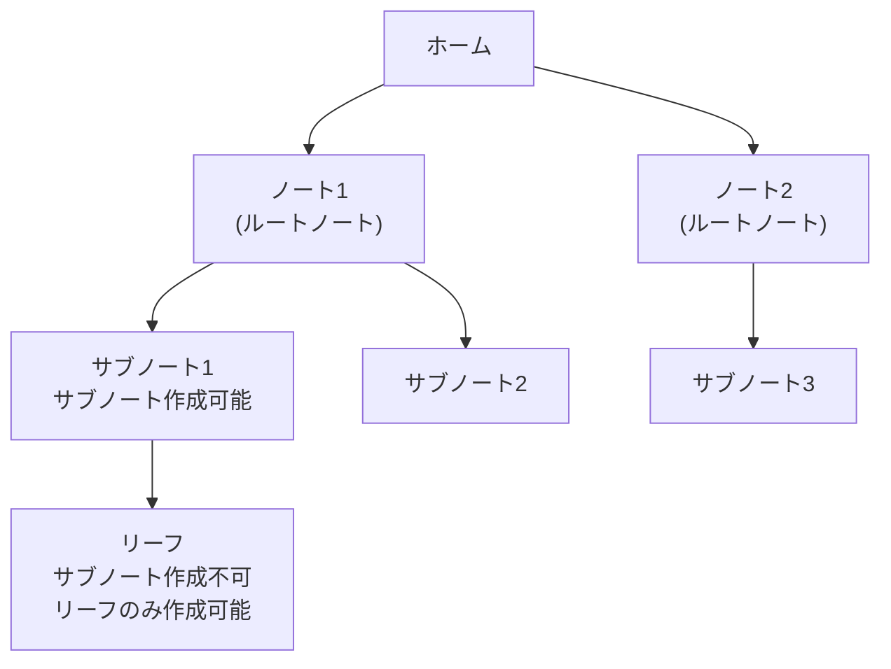

# 基本機能の実装

Agasteerの基本機能の実装詳細について説明します。

## エディタ管理

### 初期化

```typescript
function initializeEditor() {
  if (!editorContainer) return

  const extensions = [
    basicSetup,
    markdown(),
    keymap.of([...defaultKeymap, ...historyKeymap]),
    history(),
    EditorView.updateListener.of((update) => {
      if (update.docChanged && currentNote) {
        updateNoteContent(currentNote.id, update.state.doc.toString())
      }
    }),
  ]

  // テーマがdarkの場合はダークテーマを追加
  if (settings.theme === 'dark') {
    extensions.push(editorDarkTheme)
  }

  const startState = EditorState.create({
    doc: currentNote?.content || '',
    extensions,
  })

  editorView = new EditorView({
    state: startState,
    parent: editorContainer,
  })
}
```

### コンテンツリセット

ノート切り替え時にエディタ内容を更新。

```typescript
function resetEditorContent(content: string) {
  if (!editorView) return

  const newState = EditorState.create({
    doc: content,
    extensions: editorView.state.extensions,
  })

  editorView.setState(newState)
}
```

### 自動保存

エディタの変更を検知して自動保存。

```typescript
EditorView.updateListener.of((update) => {
  if (update.docChanged && currentNote) {
    updateNoteContent(currentNote.id, update.state.doc.toString())
  }
})
```

### Ctrl+S / Cmd+S でPush

#### 概要

エディタでCtrl+S（Macでは Cmd+S）を押すとGitHubにPushする機能。ブラウザの標準「ページを保存」ダイアログをオーバーライドします。

#### 実装

```typescript
// グローバルキーイベントハンドラ
window.addEventListener('keydown', (e) => {
  // Ctrl+S または Cmd+S を検出
  if ((e.ctrlKey || e.metaKey) && e.key === 's') {
    e.preventDefault() // ブラウザの保存ダイアログを防止
    handleSaveToGitHub()
  }
})
```

#### 空コミット防止

変更がない場合はPushをスキップし、不要なコミットを防止します。

```typescript
async function handleSaveToGitHub() {
  // 変更がない場合はスキップ
  if (!get(isDirty)) {
    showToast('変更がありません', 'info')
    return
  }
  // ... Push処理
}
```

#### Vimモードとの共存

- Vimモードが有効でもCtrl+Sは動作
- Vimモードでは`:w`でもPush可能

---

### Vimモード

#### 概要

CodeMirror Vimプラグインを使用したVimキーバインディングをサポート。設定画面から有効/無効を切り替え可能。

#### 有効化方法

1. 設定画面を開く
2. 「おまけ」セクションの「Vimモードを有効にする」チェックボックスをオン
3. 設定はLocalStorageに保存され、次回起動時も維持される

#### カスタムコマンド

Vimモードでは、以下のカスタムコマンドが使用可能：

| コマンド  | 動作                   | 説明                                    |
| --------- | ---------------------- | --------------------------------------- |
| `:w`      | GitHub Push            | 現在のリーフをGitHubにプッシュ（保存）  |
| `:wq`     | Push後に親ノートへ遷移 | 保存して編集画面を閉じる                |
| `:q`      | 親ノートへ遷移         | 保存せずに編集画面を閉じる              |
| `<Space>` | ペイン切り替え         | もう一方のペインに切り替え（2ペイン時） |

#### 2ペイン対応

左右のペインで独立したVimコマンド実行が可能。**今フォーカスされているエディタのペインを判定**し、適切なコールバックを実行します。

**動作例**:

- 右ペインで `:q` → 右ペインのみ閉じる
- 左ペインで `:q` → 左ペインのみ閉じる
- 左ペインで `<Space>` → 右ペインに切り替え
- 右ペインで `<Space>` → 左ペインに切り替え

#### メリット

- **キーボードのみで完結**: マウス操作不要
- **ブラウザのショートカットと競合しない**: Ctrl+Sなどと干渉しない
- **Vimユーザーにとって自然な操作**: 標準的なVimコマンドで保存・終了が可能
- **2ペイン対応**: 左右のペインで独立した操作が可能

#### 実装

##### 1. ペイン情報の管理

各エディタにペイン情報を付与：

```typescript
// DOM要素にペイン情報をマーク
editorView.dom.dataset.pane = pane // 'left' or 'right'
```

##### 2. グローバルコールバックマップ

ペイン別にコールバックを登録：

```typescript
// window経由でペイン別コールバックを共有
if (!window.editorCallbacks) {
  window.editorCallbacks = {}
}
window.editorCallbacks[pane] = {
  onSave,
  onClose,
  onSwitchPane,
}
```

##### 3. フォーカス中のペイン判定

実行時にフォーカスされているエディタのペインを取得：

```typescript
const getCurrentPane = () => {
  const activeEditor = document.activeElement?.closest('.cm-editor')
  return activeEditor?.getAttribute('data-pane') || null
}
```

##### 4. Vimコマンドの定義

グローバルに1回だけ定義し、実行時にペインを判定：

```typescript
// 初回のみVimコマンドを定義
if (!window.vimCommandsInitialized) {
  // :q コマンド
  Vim.defineEx('quit', 'q', function () {
    const paneId = getCurrentPane()
    const callbacks = paneId ? window.editorCallbacks?.[paneId] : null
    if (callbacks?.onClose) {
      callbacks.onClose()
    }
  })

  // スペースキーでペイン切り替え
  Vim.defineAction('switchPane', function () {
    const paneId = getCurrentPane()
    const callbacks = paneId ? window.editorCallbacks?.[paneId] : null
    if (callbacks?.onSwitchPane) {
      callbacks.onSwitchPane()
    }
  })
  Vim.mapCommand('<Space>', 'action', 'switchPane')

  window.vimCommandsInitialized = true
}
```

##### 型定義

```typescript
// src/global.d.ts
interface Window {
  editorCallbacks?: {
    [paneId: string]: {
      onSave?: (() => void) | null
      onClose?: (() => void) | null
      onSwitchPane?: (() => void) | null
    }
  }
  vimCommandsInitialized?: boolean
}
```

#### コマンドラインのスタイリング

Vimコマンドライン（`:` 入力部分）のスタイルは、アプリのテーマに合わせて調整されます：

```css
.cm-vim-panel {
  padding: 0.5rem 0.5rem 0.4rem 0.5rem;
  background-color: var(--bg-secondary);
  color: var(--text-primary);
  font-family: 'Courier New', monospace;
  font-size: 14px;
  line-height: 1;
  border-top: 1px solid var(--border-color);
}

.cm-vim-panel input {
  margin: 1px 0 0 0.25rem; /* `:` と入力欄を垂直方向で揃える */
}
```

---

## パンくずナビゲーション

現在位置を階層的に表示。

```typescript
function getBreadcrumbs() {
  const crumbs: Array<{
    label: string
    action: () => void
    id: string
    type: 'home' | 'folder' | 'note' | 'settings'
  }> = []

  // 常にホームを追加
  crumbs.push({
    label: 'Agasteer',
    action: goHome,
    id: 'home',
    type: 'home',
  })

  // 設定画面の場合
  if (currentView === 'settings') {
    crumbs.push({
      label: '設定',
      action: goSettings,
      id: 'settings',
      type: 'settings',
    })
    return crumbs
  }

  // フォルダ階層を追加
  if (currentFolder) {
    const parentFolder = folders.find((f) => f.id === currentFolder.parentId)
    if (parentFolder) {
      crumbs.push({
        label: parentFolder.name,
        action: () => selectFolder(parentFolder),
        id: parentFolder.id,
        type: 'folder',
      })
    }
    crumbs.push({
      label: currentFolder.name,
      action: () => selectFolder(currentFolder),
      id: currentFolder.id,
      type: 'folder',
    })
  }

  // ノート編集中の場合
  if (currentNote) {
    crumbs.push({
      label: currentNote.title,
      action: () => {},
      id: currentNote.id,
      type: 'note',
    })
  }

  return crumbs
}
```

### インライン編集

パンくずリストから直接名前を変更可能。

```svelte
{#each breadcrumbs as crumb}
  <span>
    {#if editingBreadcrumb === crumb.id}
      {#if crumb.type === 'note'}
        <input bind:this={titleInput} value={crumb.label} ... />
      {:else if crumb.type === 'folder'}
        <input bind:this={folderNameInput} value={crumb.label} ... />
      {/if}
    {:else}
      <button on:click={crumb.action}>{crumb.label}</button>
      <button on:click={() => startEditingBreadcrumb(crumb)}>✏️</button>
    {/if}
  </span>
{/each}
```

---

## モーダルシステム

確認ダイアログとアラートダイアログを統一的に管理。

```typescript
let showModal = false
let modalMessage = ''
let modalType: 'confirm' | 'alert' = 'confirm'
let modalCallback: (() => void) | null = null

function showConfirm(message: string, onConfirm: () => void) {
  modalMessage = message
  modalType = 'confirm'
  modalCallback = onConfirm
  showModal = true
}

function showAlert(message: string) {
  modalMessage = message
  modalType = 'alert'
  modalCallback = null
  showModal = true
}

function confirmModal() {
  if (modalCallback) {
    modalCallback()
  }
  closeModal()
}
```

### 使用例

```typescript
// 削除確認
showConfirm('このノートを削除しますか？', () => {
  notes = notes.filter((n) => n.id !== currentNote!.id)
  persistNotes()
  goToParentFolder()
})

// エラー通知
showAlert('GitHub同期に失敗しました。')
```

---

## ノート階層制限

### 2階層制限の実装

ルートノート→サブノートの2階層までに制限。

```typescript
function createNote(parentId?: string) {
  if (isOperationsLocked) return
  const allNotes = $notes

  // 階層制限チェック: サブノートの下にはサブノートを作成できない
  if (parentId) {
    const parentNote = allNotes.find((n) => n.id === parentId)
    if (parentNote && parentNote.parentId) {
      showAlert('サブノートの下にはサブノートを作成できません。')
      return
    }
  }

  // ... ノート作成処理
}
```

### UIでの制御

```svelte
<script>
  // リアクティブ宣言: currentNoteが変わるたびに再計算
  $: canHaveSubNote = !currentNote.parentId
</script>

{#if canHaveSubNote}
  <button on:click={onCreateNote}>新規サブノート</button>
{/if}
```

### 階層構造



---

## 関連ドキュメント

- [UI/UX機能](./ui-features.md) - 2ペイン表示
- [コンテンツ同期機能](./content-sync.md) - リーフのタイトルと#見出しの同期
- [プレビュー機能](./preview-features.md) - マークダウンプレビュー、スクロール同期
- [データ保護機能](./data-protection.md) - Push回数カウント、未保存変更の確認
