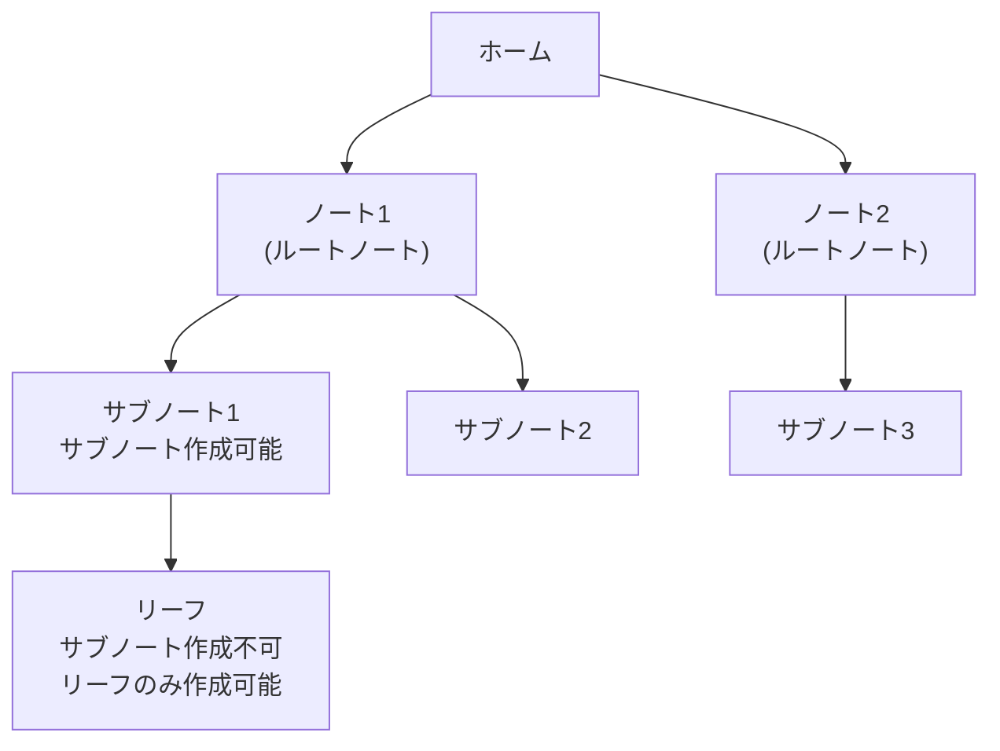

# 基本機能の実装

Agasteerの基本機能の実装詳細について説明します。

## エディタ管理

### 初期化

CodeMirrorのEditorStateとEditorViewを使用してエディタを初期化します。basicSetupの代わりに個別の拡張機能を追加し、テーマに応じたスタイルを適用します。

### モバイル互換性

#### basicSetup の代替

CodeMirrorの`basicSetup`は多くの便利な拡張機能をバンドルしていますが、モバイルデバイス（特にAndroid + Gboard）で問題を引き起こす拡張機能が含まれています。

**問題**: `highlightActiveLine()`拡張機能がGboardと相性が悪く、段落をまたぐ範囲選択を行うと選択が中断されてポップアップメニューが表示される。

**解決策**: `basicSetup`を使用せず、必要な拡張機能を個別にインポートし、`highlightActiveLine()`を除外する。

#### Gboard関連の既知の制約

Android端末でGboardを使用している場合、空行（段落と段落の間の空白行）をタップするとスクロール位置が意図しない場所にジャンプする現象が発生します。これはGboardがCodeMirrorのフォーカス処理に介入することで起こるもので、CodeMirror側での修正は困難です。

**回避策**: 空行をタップする代わりに、テキストがある行をタップしてからカーソルを移動する。

詳細は[既知の課題](./future-plans.md#その他の既知の制約)を参照してください。

### コンテンツリセット

ノート切り替え時にエディタ内容を更新。EditorState.createで新しい状態を作成し、setStateで適用します。

### 自動保存

EditorView.updateListenerでドキュメントの変更を検知し、自動的にストアを更新します。

### Ctrl+S / Cmd+S でPush

#### 概要

エディタでCtrl+S（Macでは Cmd+S）を押すとGitHubにPushする機能。ブラウザの標準「ページを保存」ダイアログをオーバーライドします。

#### 動作

- windowのkeydownイベントでCtrl+S / Cmd+Sを検出
- `e.preventDefault()`でブラウザの保存ダイアログを防止
- isDirtyフラグで変更がない場合はPushをスキップ（空コミット防止）

#### Vimモードとの共存

- Vimモードが有効でもCtrl+Sは動作
- Vimモードでは`:w`でもPush可能

---

### Vimモード

#### 概要

CodeMirror Vimプラグインを使用したVimキーバインディングをサポート。設定画面から有効/無効を切り替え可能。

#### 有効化方法

1. 設定画面を開く
2. 「おまけ」セクションの「Vimモードを有効にする」チェックボックスをオン
3. 設定はLocalStorageに保存され、次回起動時も維持される

#### カスタムコマンド

Vimモードでは、以下のカスタムコマンドが使用可能：

| コマンド  | 動作                   | 説明                                    |
| --------- | ---------------------- | --------------------------------------- |
| `:w`      | GitHub Push            | 現在のリーフをGitHubにプッシュ（保存）  |
| `:wq`     | Push後に親ノートへ遷移 | 保存して編集画面を閉じる                |
| `:q`      | 親ノートへ遷移         | 保存せずに編集画面を閉じる              |
| `<Space>` | ペイン切り替え         | もう一方のペインに切り替え（2ペイン時） |

#### 2ペイン対応

左右のペインで独立したVimコマンド実行が可能。**今フォーカスされているエディタのペインを判定**し、適切なコールバックを実行します。

**動作例**:

- 右ペインで `:q` → 右ペインのみ閉じる
- 左ペインで `:q` → 左ペインのみ閉じる
- 左ペインで `<Space>` → 右ペインに切り替え
- 右ペインで `<Space>` → 左ペインに切り替え

#### メリット

- **キーボードのみで完結**: マウス操作不要
- **ブラウザのショートカットと競合しない**: Ctrl+Sなどと干渉しない
- **Vimユーザーにとって自然な操作**: 標準的なVimコマンドで保存・終了が可能
- **2ペイン対応**: 左右のペインで独立した操作が可能

#### 実装の仕組み

1. **ペイン情報の管理**: 各エディタのDOM要素に`data-pane`属性でペイン識別子（'left'/'right'）を付与
2. **グローバルコールバックマップ**: `window.editorCallbacks`にペイン別のコールバック（onSave, onClose, onSwitchPane）を登録
3. **フォーカス中のペイン判定**: `document.activeElement`から現在フォーカスされているエディタのペインを取得
4. **Vimコマンドの定義**: グローバルに1回だけ定義し、実行時にペインを判定して適切なコールバックを呼び出す

#### コマンドラインのスタイリング

Vimコマンドライン（`:` 入力部分）は`.cm-vim-panel`クラスでスタイリングされ、アプリのテーマ変数に連動します。

---

## パンくずナビゲーション

現在位置を階層的に表示。各要素は`label`、`action`（クリック時の遷移先）、`id`、`type`（home/folder/note/settings）を持ちます。

- 常にホームを先頭に追加
- 設定画面の場合は「設定」のみ
- ノート画面ではフォルダ階層（親→子）を表示
- リーフ編集中はノートタイトルも表示

### インライン編集

パンくずリストから直接名前を変更可能。編集アイコンをクリックするとinput要素に切り替わり、その場で名前を編集できます。

---

## モーダルシステム

確認ダイアログ、アラートダイアログ、入力ダイアログを統一的に管理。

### モーダルの種類

| 種類    | 関数          | 説明                                 |
| ------- | ------------- | ------------------------------------ |
| confirm | showConfirm() | はい/いいえの確認ダイアログ          |
| alert   | showAlert()   | OKボタンのみの通知ダイアログ         |
| prompt  | showPrompt()  | テキスト入力フィールド付きダイアログ |

### 表示位置

`position`パラメータで表示位置を指定可能（center, bottom-left, bottom-right）。2ペイン表示時は左ペインのモーダルをbottom-left、右ペインをbottom-rightに表示します。

### 新規ノート/リーフ作成フロー

フッターの新規ノート/リーフボタンをクリックすると、入力モーダルが表示される：

1. ボタンクリックで `showPrompt` を呼び出し
2. モーダルで名前を入力
3. OK（またはEnter）で作成実行、キャンセル（またはEsc）で中止
4. 左ペインは `bottom-left`、右ペインは `bottom-right` に表示

---

## ノート階層制限

### 2階層制限の実装

ルートノート→サブノートの2階層までに制限。ノート作成時に`parentId`を持つノートの下には新しいノートを作成できないようチェックします。

### UIでの制御

`canHaveSubNote`フラグで「新規サブノート」ボタンの表示を制御。サブノートの下にはサブノートを作成できないため、ボタンを非表示にします。

### 階層構造

---

## 関連ドキュメント

- [UI/UX機能](./ui-features.md) - 2ペイン表示
- [コンテンツ同期機能](./content-sync.md) - リーフのタイトルと#見出しの同期
- [プレビュー機能](./preview-features.md) - マークダウンプレビュー、スクロール同期
- [データ保護機能](./data-protection.md) - Push回数カウント、未保存変更の確認
