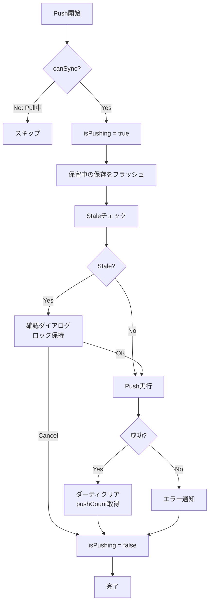
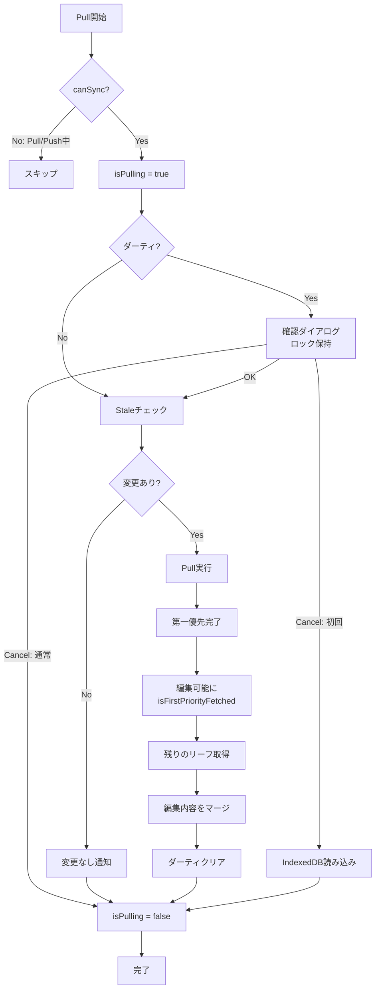
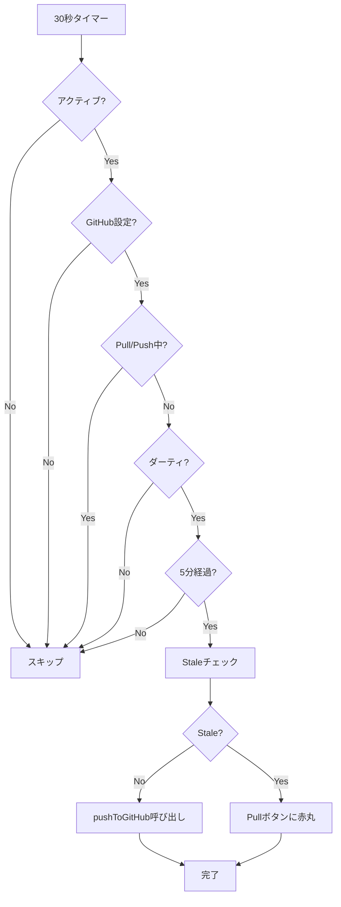

# Push/Pull処理

## 設計思想

### 1つの統合関数による排他制御

Push/Pull処理は、それぞれ**1つの統合関数**に集約されています：

- **Push**: `pushToGitHub()` - すべてのPush操作がこの関数を通る
- **Pull**: `pullFromGitHub()` - すべてのPull操作がこの関数を通る

この設計により、以下を実現しています：

1. **自動的な排他制御**: 各関数の冒頭で即座にロック（`$isPushing` / `$isPulling`）を取得し、finally句で必ず解放
2. **データ損失の防止**: 非同期処理の最中に他の操作が割り込むことを根本的に防止
3. **コードの可読性**: 分散していたロジックが1箇所に集約され、動作を理解しやすい

### Promise版ダイアログによるロック保持

確認ダイアログ表示中もロックを保持するため、Promise版のダイアログ関数を使用：

- `confirmAsync(message)` - 確認ダイアログ（true/false を返す）
- `promptAsync(message, placeholder)` - 入力ダイアログ（string/null を返す）

従来のコールバック版（`showConfirm`）では、ダイアログ表示中にロックを解放する必要がありましたが、Promise版では`await`で待機することでロックを保持したまま処理を継続できます。

---

## Push処理

### pushToGitHub() - 統合関数

すべてのPush操作（ボタンクリック、Ctrl+S、自動Push、Vim `:w`）は、この1つの関数を通ります。

**処理ステップ:**

1. 交通整理: Pull/Push中は不可
2. 即座にロック取得（非同期処理の前に取得することが重要）
3. 保留中の自動保存をフラッシュ
4. Staleチェック（共通関数で時刻も更新）
5. Stale編集の場合は確認（ロックを保持したまま await）
6. Push実行
7. 結果処理（成功時はダーティクリア、リモートからpushCount取得）
8. ロック解放（finallyで必ず実行）

### Push処理フロー



### 排他制御のポイント

1. **ロック取得は最初**: `canSync`チェック直後、すべての非同期処理の前にロックを取得
2. **finally句で解放**: 成功・失敗・エラー・キャンセルに関わらず、必ずロックを解放
3. **ダイアログ中もロック保持**: `await confirmAsync()`でロックを保持したまま待機

### データ損失が起きる可能性があった箇所（修正済み）

**修正前の問題:**

ロック取得が遅く、`flushPendingSaves()`の間にPullが開始される可能性がありました。

**修正後:**

即座にロック取得し、try-finallyで確実に解放します。

### Push処理の原子性と失敗時の安全性

**PullとPushの構造的な違い:**

| 処理 | 構造                 | API呼び出し数                  | 部分的失敗                     |
| ---- | -------------------- | ------------------------------ | ------------------------------ |
| Pull | 並列処理             | リーフ数だけ（100個なら100回） | あり得る（一部成功、一部失敗） |
| Push | 単一トランザクション | 固定3回（Tree→Commit→Ref）     | なし（全成功か全失敗）         |

**Push処理の3段階:**

1. **Tree作成**: 全ファイルを1つのJSONで送信
2. **Commit作成**: 上記Treeを指すCommitオブジェクトを作成
3. **Ref更新**: ブランチのHEADを新Commitに向ける

**各段階での失敗時の挙動:**

```typescript
// どの段階で失敗しても success: false を返す
if (!newTreeRes.ok) {
  return { success: false, message: 'github.treeCreateFailed' }
}
if (!newCommitRes.ok) {
  return { success: false, message: 'github.commitCreateFailed' }
}
if (!updateRefRes.ok) {
  return { success: false, message: 'github.branchUpdateFailed' }
}
```

**ダーティフラグの扱い:**

```typescript
// App.svelte: 成功時のみダーティクリア
if (result.variant === 'success') {
  setLastPushedSnapshot(...)
  clearAllChanges()  // ← 成功時のみ
  lastPushTime.set(Date.now())
}
```

失敗時はダーティフラグが維持されるため、ユーザーが再度Pushボタンを押すと全データが再送信されます（冪等性あり）。

**Orphan Commitの扱い:**

Commit作成は成功したがRef更新で失敗した場合、Commitオブジェクトは作られますがブランチから到達不可能（orphan）になります。

- 次回Push時に別の新しいCommitを作成（重複するが無害）
- GitHubのGC（garbage collection）で自動削除される
- 実害がないため、特別な処理は不要

**結論:**

Push処理は単一のトランザクション的処理であり、「一部だけ送信成功」という状態は起きません。Pullのような並列処理特有の問題（一部失敗での全体失敗処理）は存在せず、現在の実装で十分安全です。

---

## Pull処理

### pullFromGitHub() - 統合関数

すべてのPull操作（ボタンクリック、初回Pull、設定画面閉じる）は、この1つの関数を通ります。

**処理ステップ:**

1. 交通整理: Pull/Push中は不可
2. 即座にロック取得
3. ダーティチェック（ロックを保持したまま確認ダイアログ）
4. Staleチェック（up_to_dateなら早期リターン）
5. Pull実行（第一優先で編集可能に、残りはバックグラウンド）
6. 結果処理（成功時はpushCount更新、ダーティクリア）
7. ロック解放（finallyで必ず実行）

### Pull処理フロー



### 第一優先Pull - 段階的ローディング

Pull処理は、ユーザーが早く編集を開始できるよう、優先度ベースで段階的に実行されます：

1. **構造取得**: ノート構造とリーフスケルトンを取得
2. **第一優先リーフ取得**: URLで指定されたリーフを最優先で取得
3. **閲覧・編集可能に**: `isFirstPriorityFetched = true`, `isLoadingUI = false`（全体のガラス効果解除）
4. **残りのリーフ取得**: バックグラウンドで10並列取得（`CONTENT_FETCH_CONCURRENCY = 10`）
5. **全操作可能に**: `isPullCompleted = true`（フッタのボタン有効化）

**UI制御の段階:**

- **第1段階完了まで**: 全体がガラス効果（`isLoadingUI = true`）で完全に操作不可
- **第1段階完了後**: ガラス効果解除、リーフの閲覧・編集が可能、ただしフッタのボタン（作成・削除・移動など）は無効化（`!isPullCompleted`）
- **第2段階完了後**: すべての操作が可能

これにより、残りのリーフ取得中にユーザーが同名リーフを作成したり、まだ取得していないノートを削除するなどの矛盾を防ぎます。

**PullOptionsコールバック:**

- `onStructure`: ノートとメタデータをストアに設定し、URLから優先情報を返す
- `onLeaf`: 各リーフをストアに追加
- `onPriorityComplete`: 閲覧・編集許可、ガラス効果解除、URL復元

### Pull中の編集保護

Pull処理中（第一優先完了後）にユーザーが編集を行った場合、その編集内容を保護します：

- ダーティなリーフを識別してMapに保持
- Pull結果とマージ時、ダーティなリーフは編集内容とダーティ状態を維持
- Pull完了後、ダーティな変更がない場合のみクリア

---

## 自動Push処理

### 自動Pushの条件

30秒ごとに以下の条件をチェックし、すべて満たす場合のみ`pushToGitHub()`を呼び出します：

1. タブがアクティブ（`document.visibilityState === 'visible'`）
2. GitHub設定済み
3. Pull/Push中でない
4. ダーティフラグが立っている
5. 最後のPushから5分経過

自動Pushも`pushToGitHub()`を呼ぶため、手動Pushと完全に同じ排他制御が適用されます。

### 自動Pushフロー



自動Pushも`pushToGitHub()`を呼ぶため、手動Pushと完全に同じ排他制御が適用されます。

---

## Push回数カウント機能

### 概要

アプリの使用状況を可視化するため、GitHub Push回数をカウントして統計情報として表示します。

### データ構造

Push回数は `metadata.json` の `pushCount` フィールドに保存されます。

### Push時の自動インクリメント

`executePush` 関数内で、Push実行前に既存の `pushCount` を取得し、+1してmetadata.jsonに保存します。

### Pull時のデータ取得

`executePull` 関数内で、metadata.jsonから `pushCount` を取得し、Svelteストアに保存します。後方互換性のため、フィールドが存在しない場合は0として扱います。

### UI表示

StatsPanel.svelte でホーム画面の右下に`lastPulledPushCount`を統計情報として表示します。Push成功後はリモートから最新の`pushCount`を取得して更新するため、常に正確な値が表示されます。

---

## データ損失バグの撲滅

### 発生していた問題

Pull実行中にPushが開始されると、以下のような順序でデータ損失が発生していました：

1. Pull開始
2. Pull中にPushボタンをクリック
3. Push処理がロック取得前の非同期処理（flushPendingSaves等）を実行
4. その間にPullが完了し、leaves.set([]) でデータをクリア
5. Pushが実行され、空のデータをGitHubにPush
6. リーフが消失

### 解決方法

1. **ロック取得を最初に**: すべての非同期処理の前にロックを取得
2. **finally句で解放**: 必ずロックを解放
3. **Promise版ダイアログ**: ダイアログ表示中もロックを保持
4. **統合関数**: すべての操作が1つの関数を通るため、抜け穴がない

### 修正箇所

| 修正前                                                         | 修正後                                                         |
| -------------------------------------------------------------- | -------------------------------------------------------------- |
| `handlePushToGitHub()` + `executePushInternal()`（2関数）      | `pushToGitHub()`（1関数）                                      |
| `handlePull()` + `executePullInternal()`（2関数）              | `pullFromGitHub()`（1関数）                                    |
| `showConfirm(message, onOK, onCancel)`（コールバック版）       | `await confirmAsync(message)`（Promise版）                     |
| `await flushPendingSaves(); $isPushing = true`（ロックが遅い） | `$isPushing = true; await flushPendingSaves()`（ロックが早い） |

### 動作フロー（例：自動Push中にPullボタンをクリック）

1. 自動Push開始
2. pushToGitHub() → canSync OK → $isPushing = true（即座にロック）
3. flushPendingSaves() 実行中...
4. Pullボタンをクリック
5. pullFromGitHub() → canSync → $isPushing = true を検出 → return
6. Pull は実行されない ✅
7. Push処理が完了
8. $isPushing = false（ロック解放）

---

## 不完全Pull時のデータ保護

### 発生していた問題

Pull中に一部のリーフ取得が失敗すると、不完全な状態でPull成功と判定され、次のPushでデータが消失する可能性がありました：

1. Pull開始、10並列でリーフ取得
2. 一部のリーフで取得失敗（ネットワーク遅延等）→ `return null`で除外
3. Pull成功として処理、不完全なリーフリストがIndexedDBに保存
4. ユーザーがPush
5. GitHubにあるが、IndexedDBにないリーフが「削除された」と判定
6. リーフ消失

### 解決方法

1. **失敗検出**: リーフ取得失敗を`failedLeafPaths`配列に記録
2. **Pull全体を失敗扱い**: 1件でも失敗があれば`success: false`を返す
3. **UIロック維持**: `isFirstPriorityFetched = false`でガラス効果を維持
4. **ストアクリア**: 不完全なデータでのPushを防ぐ

### 不完全Pull時の動作

- UIはガラス効果でロック（初回Pull前と同じ状態）
- オフラインリーフのみ編集可能
- ノート・リーフの作成・編集・削除は不可
- Pushボタンは機能しない（`canSync`チェックで弾かれる）
- 再度Pullを試行してすべてのリーフを取得する必要がある

---

## まとめ

- **Push処理**: `pushToGitHub()` - 1つの統合関数
- **Pull処理**: `pullFromGitHub()` - 1つの統合関数
- **ロック管理**: 最初に取得、finally句で解放、Promise版ダイアログでロック保持
- **データ損失**: 排他制御の強化により撲滅
- **第一優先Pull**: 段階的ローディングで早期編集開始
- **編集保護**: Pull中の編集内容を保持
- **不完全Pull保護**: リーフ取得失敗時はUIをロックしてデータ消失を防止
