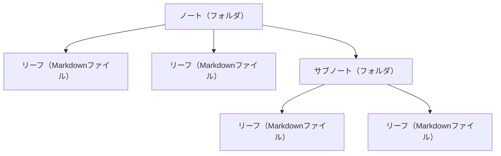

# ノートとリーフの管理

> Agasteerの基本的な使い方を説明します。

---

## 📂 ノートとリーフとは？

Agasteerは2階層の構造でノートを管理します。



- **ノート**: フォルダのような役割（最大2階層まで）
- **リーフ**: 実際のMarkdownファイル

---

## 📝 ノートの管理

### ノートの作成

1. ホーム画面でフッターの「新規ノート」ボタン（フォルダ+アイコン）をクリック
2. 自動的に「ノート1」「ノート2」という名前で作成されます
3. ノート内で「新規サブノート」ボタン（フォルダ+アイコン）をクリックすると、2階層目のノートを作成

### ノートの編集

Agasteerでは、ノート自体は編集せず、ノート名の変更のみ可能です。

#### ノート名の変更

1. ノートを開く
2. パンくずリストのノート名横にある✏️アイコンをクリック
3. 新しい名前を入力してEnterキー

### ノートのバッジ

ノートカードの右上にバッジ（アイコン＋色）を設定できます。

#### バッジの設定方法

1. ノートカードの右上にある「+」をクリック
2. **アイコン選択**: 5×5グリッドから好きなアイコンを選択（スター、ハート、チェックなど25種類）
3. **色選択**: 5色のパレットから色を選択
4. 選択すると即座に反映されます

#### バッジの削除

1. バッジをクリック
2. 現在選択中のアイコンをもう一度クリック（デフォルトの「+」に戻る）

### ノートの並び替え

- ノートをドラッグ&ドロップで好きな順番に並び替え
- 同じ階層内でのみ並び替え可能
- 親ノートとサブノートは別々に管理されます

### ノートの削除

1. ノート画面の🗑️ボタン（ノートを削除）をクリック
2. 確認ダイアログが表示されます

**注意**: サブノートやリーフが含まれている場合は削除できません。先にサブノートやリーフを削除してください。

---

## 📄 リーフの管理

### リーフの作成

1. ノートを開く
2. フッターの「新規リーフ」ボタン（ドキュメント+アイコン）をクリック
3. 自動的に「リーフ1」「リーフ2」という名前で作成されます

### リーフの編集

1. リーフをクリックして開く
2. エディタでMarkdownを記述
3. リアルタイムでIndexedDBに自動保存されます
4. 💾ボタンでGitHubにPush（GitHub連携を設定している場合）

#### リーフタイトルと#見出しの同期

Agasteerには便利な機能があります。

- **1行目が `# 見出し` の場合、リーフタイトルが自動更新されます**
- 逆に、リーフタイトルを変更すると、1行目の`# 見出し`も更新されます

例：

```markdown
# 私の日記

今日はいい天気でした。
```

この場合、リーフタイトルが「私の日記」に自動的に変更されます。

### リーフのプレビュー

1. エディタ画面の👁️ボタン（プレビュー）をクリック
2. マークダウンがHTMLレンダリングされて表示されます
3. もう一度クリックで編集モードに戻ります

プレビュー機能の詳細は[応用機能](./advanced-features.md)をご覧ください。

### リーフのバッジ

リーフカードにもバッジを設定できます。設定方法はノートと同じです。

1. リーフカードの右上にある「+」をクリック
2. アイコンと色を選択

### リーフの並び替え

- 同じノート内でリーフをドラッグ&ドロップで並び替え

### リーフの移動

リーフを別のノートに移動できます。

1. 移動したいリーフを開く
2. フッターの「移動」ボタンをクリック
3. 移動先のノートを選択
4. 確認ダイアログで「OK」をクリック

- 移動後は移動先のノートに遷移します
- ノートも同様に移動できます

### リーフの削除

1. エディタ画面の🗑️ボタン（リーフを削除）をクリック
2. 確認ダイアログが表示されます

---

## 📦 アーカイブ機能

使わなくなったノートやリーフをアーカイブして、通常の表示から隠すことができます。アーカイブしたデータはいつでもリストア（復元）できます。

### アーカイブとは？

- **Home**: 通常使用するノート・リーフの場所
- **Archive**: 使わなくなったノート・リーフを保管する場所

アーカイブ機能の主なメリット:

- **Pull時間の短縮**: Archiveは必要な時だけ読み込まれるため、通常のPullが高速になります
- **整理整頓**: 古いノートをArchiveに移動することで、Homeがすっきりします
- **データは安全**: アーカイブしたデータはGitHubに保存され、いつでもリストアできます

### Home / Archiveの切り替え

1. パンくずリストの左端（ホームアイコンの左）にある「›」をクリック
2. ドロップダウンが表示されます
3. **Home** または **Archive** を選択

Archive選択時に初めてアクセスする場合は、GitHubからArchiveデータがPullされます（遅延ロード）。

### ノート・リーフのアーカイブ

1. アーカイブしたいノートまたはリーフを開く
2. フッターの「アーカイブ」ボタンをクリック
3. 確認ダイアログで「OK」をクリック

- アーカイブ後は親ノートに遷移します（削除と同じ動作）
- サブノートを持つノートをアーカイブすると、サブノートとリーフも一緒にアーカイブされます
- アーカイブ先に同名のノート・リーフがある場合は、自動的にサフィックス（Note1, Note2...）が付与されます

### ノート・リーフのリストア（復元）

1. Archiveに切り替える
2. リストアしたいノートまたはリーフを開く
3. フッターの「リストア」ボタンをクリック
4. 確認ダイアログで「OK」をクリック

- リストア後は親ノートに遷移します（削除と同じ動作）
- リストア先に同名のノート・リーフがある場合は、自動的にサフィックスが付与されます

### タイトルクリックでHomeに戻る

アプリ左上のタイトル（Agasteer）をクリックすると、どのワールドにいても必ずHomeのトップに戻ります。

---

## 💾 ローカルへの保存

個別のリーフをローカルにダウンロードできます。

1. リーフを開く
2. ⬇️ボタン（ダウンロード）をクリック
3. `.md`ファイルとしてダウンロードされます

ファイル名は `リーフ名.md` の形式です。

---

## 📊 ホーム画面の統計情報

ホーム画面の右下に、アプリの使用状況を示す統計情報が表示されます。

### 表示項目

- **リーフ数**: 作成したリーフの総数
- **文字数**: 全リーフの総文字数
- **Push回数**: GitHubへのPush回数

### 特徴

- 半透明で控えめに表示（ノート/リーフカードの邪魔にならない）
- 数値は3桁カンマ区切りで表示（例: 1,234）
- リアルタイムで更新されます

---

## 🧭 ナビゲーション

### ホームに戻る

ヘッダーの「Agasteer」をクリックすると、ホーム画面に戻ります。

### パンくずリスト

現在の場所を表示するパンくずリストが表示されます。

例：`Agasteer > ノート1 > サブノート1 > リーフ1`

- 各項目をクリックすると、その階層に移動できます
- パンくずリストから直接URLコピーやMarkdownコピーもできます

### ブラウザの戻る/進むボタン

AgasteerはURLルーティングに対応しています。

- ブラウザの戻るボタンで前の画面に戻れます
- 進むボタンで先の画面に進めます
- URLを直接入力/ブックマークすることも可能

---

## 🎯 次のステップ

基本的な使い方を理解したら、応用機能を学びましょう。

→ [応用機能](./advanced-features.md)

---

**関連ドキュメント**:

- [応用機能](./advanced-features.md)
- [GitHub連携](./github-sync.md)
- [カスタマイズ](./customization.md)
