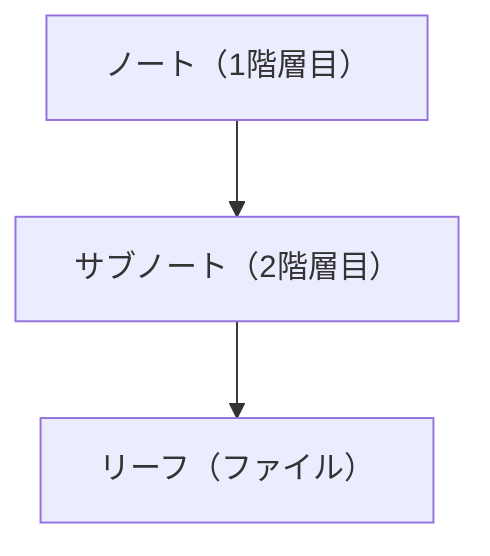

# よくある質問（FAQ）

> Agasteerについてよくある質問と回答をまとめました。

---

## 🖥️ 動作環境について

### Q: サーバーは必要ですか？

**A:** いいえ、完全にブラウザ上で動作します。

- サーバーサイドのプログラムは不要です
- 静的ホスティング（Cloudflare Pages、GitHub Pages、Netlify等）で公開できます
- ブラウザだけで完結するため、セットアップが簡単です

### Q: オフラインで使えますか？

**A:** はい、一度読み込めばオフラインで編集できます。

- データはブラウザのIndexedDBに保存されます
- ただし、GitHub同期にはインターネット接続が必要です
- PWA対応のため、ホーム画面に追加すればさらに快適です

### Q: モバイルでも使えますか？

**A:** はい、レスポンシブデザインでモバイルブラウザでも動作します。

- スマホでも快適に編集できます
- スマホを横向きにすると2ペイン表示にも対応します
- PWA対応のため、ネイティブアプリのように使えます

---

## 📁 データ管理について

### Q: 既存のMarkdownファイルをインポートできますか？

**A:** 現在、インポート機能はありません。

ただし、以下の方法で既存のファイルを読み込めます：

1. GitHub上の`notes/`ディレクトリに手動でMarkdownファイルを配置
2. AgasteerでPullを実行
3. ファイルがIndexedDBに読み込まれます

### Q: データはどこに保存されますか？

**A:** 3箇所に保存されます。

- **ブラウザのIndexedDB**: ノート・リーフのデータ、カスタムフォント、背景画像
- **ブラウザのLocalStorage**: 設定情報（GitHub Token、テーマ、言語等）
- **GitHub**: ノート・リーフのデータ（Push実行時のみ）

### Q: データのバックアップは必要ですか？

**A:** はい、推奨します。

IndexedDBはブラウザのキャッシュクリアで消える可能性があります。以下の方法でバックアップを取ってください：

- GitHub同期を実行してバックアップ
- ダウンロード機能でローカルに保存
- 定期的にブラウザのバックアップを取る

---

## 🔄 同期について

### Q: 複数のデバイスで同期できますか？

**A:** はい、GitHub同期は双方向対応しています。

複数デバイスで同じリポジトリにPull/Pushすることで同期できます。

**注意**: 競合解決UIはまだ実装されていません。複数デバイスで同時編集すると、後からPushしたデータで上書きされます。

### Q: GitHub同期は必須ですか？

**A:** いいえ、GitHub同期は任意です。

- GitHub連携を設定しなくても、ローカルのIndexedDBで動作します
- ただし、複数デバイスでの同期やバックアップには、GitHub連携が推奨されます

---

## 📝 ノート管理について

### Q: ノート階層を3階層以上にできますか？

**A:** いいえ、現在は2階層（親ノートとサブノート）まで対応しています。

これはシンプルさを保つための設計です。



### Q: ノートやリーフを別のノートに移動できますか？

**A:** 現在、リーフの移動機能はありません。

- 同じノート内でリーフの並び替えはできます
- 別のノートへの移動は手動でコピー&ペーストが必要です

---

## 🖼️ 画像・メディアについて

### Q: 画像は埋め込めますか？

**A:** Markdownの画像構文は使用できますが、画像アップロード機能はありません。

以下の方法で画像を表示できます：

1. GitHub上の`images/`ディレクトリに画像を配置
2. Markdown内で``のように参照

または、外部の画像ホスティングサービス（Imgur、Cloudinaryなど）を使用することもできます。

### Q: 動画や音声ファイルは埋め込めますか？

**A:** Markdown内でHTMLタグを使えば可能です。

例：

```html
<video src="https://example.com/video.mp4" controls></video>
<audio src="https://example.com/audio.mp3" controls></audio>
```

ただし、DOMPurifyでサニタイゼーションされるため、一部のHTMLタグは使用できない可能性があります。

---

## 🔒 セキュリティについて

### Q: GitHub Tokenはどこに保存されますか？

**A:** ブラウザのLocalStorageに平文で保存されます。

セキュリティ上の推奨事項：

- ✅ 信頼できる個人端末でのみ使用する
- ✅ トークンには適切な有効期限を設定する
- ✅ 定期的にトークンをローテーションする
- ❌ 共用端末では使用しない
- ❌ トークンを他人と共有しない

### Q: データは暗号化されますか？

**A:** GitHub通信はHTTPSで暗号化されます。

- ブラウザ内のIndexedDB/LocalStorageは暗号化されません
- GitHubとの通信はHTTPSで暗号化されます
- 機密情報を扱う場合は、信頼できる端末でのみ使用してください

---

## ⚙️ カスタマイズについて

### Q: 独自のテーマを作成できますか？

**A:** 現在、UI上でのテーマ作成機能はありません。

ただし、以下の方法で独自テーマを作成できます：

1. リポジトリをクローン
2. `src/lib/theme.ts`を編集
3. ビルドして自分でホスティング

### Q: カスタムフォントや背景画像はGitHubに保存されますか？

**A:** いいえ、ブラウザのIndexedDBのみに保存されます。

- サイズが大きいため、GitHubには保存されません
- 複数デバイスで使う場合は、各デバイスで再度アップロードが必要です

---

## 🛠️ トラブルシューティング

### Q: Pushが失敗します

**A:** 以下を確認してください：

1. GitHub Tokenが正しいか確認
2. トークンに`repo`スコープが付与されているか確認
3. リポジトリ名が`owner/repo`形式で正しいか確認
4. リポジトリが存在するか確認
5. トークンの有効期限が切れていないか確認

### Q: Pullが失敗します

**A:** 以下を確認してください：

1. GitHub Tokenが正しいか確認
2. リポジトリ名が正しいか確認
3. リポジトリが存在するか確認
4. `notes/`ディレクトリがリポジトリに存在するか確認

### Q: データが消えました

**A:** 以下の原因が考えられます：

1. ブラウザのキャッシュをクリアした
2. ブラウザのプライベートモードで使用していた
3. 別のブラウザ/プロファイルで開いている

**対策**: GitHub同期を使用している場合、Pullを実行すればデータを復元できます。

### Q: Vimモードが効かない

**A:** 以下を確認してください：

1. 設定画面でVimモードがONになっているか確認
2. エディタをクリックしてフォーカスしているか確認
3. インサートモードではなく、ノーマルモードになっているか確認（Escキーでノーマルモードに戻る）

---

## 📞 その他

### Q: バグを見つけました。どこに報告すればいいですか？

**A:** GitHubのIssueで報告してください。

- **リポジトリ**: [agasteer](https://github.com/kako-jun/agasteer)
- Issueページで「New Issue」をクリック
- バグの詳細を記載してください

### Q: 新しい機能をリクエストできますか？

**A:** はい、GitHubのIssueで機能リクエストを受け付けています。

- Feature Requestのテンプレートを使用してください
- どのような機能が欲しいか、なぜ必要かを記載してください

### Q: コントリビュートしたいです

**A:** 歓迎します！

- **CONTRIBUTING.md**をご覧ください
- Pull Requestをお待ちしています

---

## 🎯 次のステップ

質問が解決しない場合は、開発者向けドキュメントも参照してください。

→ [開発者向けドキュメント](../development/index.md)

---

**関連ドキュメント**:

- [初期設定](./getting-started.md)
- [GitHub連携](./github-sync.md)
- [GitHub連携セットアップガイド](./ja/github-setup.md)
